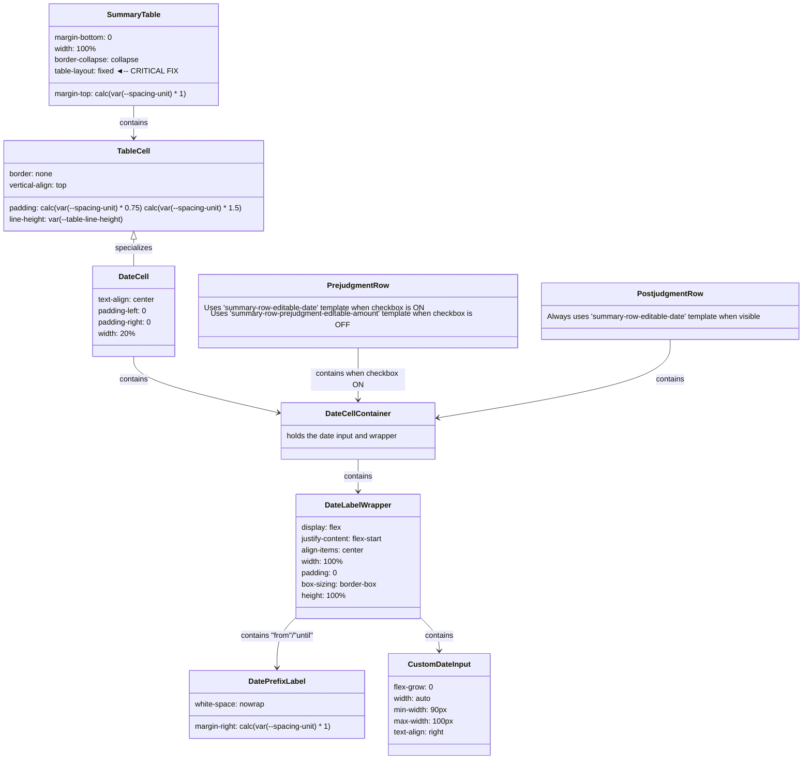

# Summary Table CSS Structure Analysis & Fix

The following Mermaid diagram shows the updated CSS class structure and relationships in the summary table after fixing the wiggle issue.



## Template Structure for Prejudgment Row (Checkbox ON)
```html
<tr>
  <td class="text-left" data-display="itemLabel">
    <span data-display="itemText">Prejudgment Interest</span>
  </td>
  <td class="text-center date-cell-container">
    <div class="date-label-wrapper">
      <span class="help-icon" data-display="helpIcon">?
        <span class="tooltip" data-display="tooltipText"></span>
      </span>
      <span data-display="dateLabel" class="date-prefix-label">from</span>
      <input type="text" class="custom-date-input" data-input="dateValue">
    </div>
  </td>
  <td class="text-right" data-display="amountValue">$256.61</td>
</tr>
```

## Template Structure for Prejudgment Row (Checkbox OFF)
```html
<tr>
  <td class="text-left" data-display="itemLabel">
    <span data-display="itemText">Prejudgment Interest</span>
  </td>
  <td class="text-center">
    <!-- Empty cell - no date container -->
  </td>
  <td class="text-right">
    <input type="text" data-input="prejudgmentAmountValue" class="text-right">
  </td>
</tr>
```

## Template Structure for Postjudgment Row
```html
<tr>
  <td class="text-left" data-display="itemLabel">
    <span data-display="itemText">Postjudgment Interest</span>
  </td>
  <td class="text-center date-cell-container">
    <div class="date-label-wrapper">
      <span class="help-icon" data-display="helpIcon">?
        <span class="tooltip" data-display="tooltipText"></span>
      </span>
      <span data-display="dateLabel" class="date-prefix-label">until</span>
      <input type="text" class="custom-date-input" data-input="dateValue">
    </div>
  </td>
  <td class="text-right" data-display="amountValue">$332.97</td>
</tr>
```

## Wiggle Analysis and Solution

### Problem
The wiggle was happening because:

1. When the prejudgment checkbox is ON:
   - The prejudgment row's middle cell contains "from 2024-04-22" (12 characters)
   - The postjudgment row's middle cell contains "until 2025-04-22" (13 characters)

2. When the prejudgment checkbox is OFF:
   - The prejudgment row's middle cell is empty (0 characters)
   - The browser was adjusting column width dynamically to fit content

3. By default, browsers use the `table-layout: auto` algorithm which adjusts column widths based on content, causing the postjudgment date field to shift.

### Solution
We fixed this issue with the following CSS changes:

1. Added `table-layout: fixed` to the table:
   ```css
   .summary-table {
       table-layout: fixed; /* Critical: This prevents column width from changing based on content */
   }
   ```

2. Set precise fixed widths for each column:
   ```css
   .summary-table th:nth-child(1), .summary-table td:nth-child(1) { width: 40%; } /* Item name column */
   .summary-table th:nth-child(2), .summary-table td:nth-child(2) { width: 30%; } /* Date column */
   .summary-table th:nth-child(3), .summary-table td:nth-child(3) { width: 30%; } /* Amount column */
   ```

3. Added styles for empty cells to maintain dimensions when the date field is hidden:
   ```css
   .summary-table tr td:nth-child(2):empty::after {
       content: '';
       display: inline-block;
       width: 100%;
       min-height: 24px; /* Match the height of the date input */
   }
   ```

The `table-layout: fixed` property is the key fix that forces the browser to honor our column width definitions regardless of the content inside the cells. This ensures the columns maintain stable widths when content changes or is hidden.
