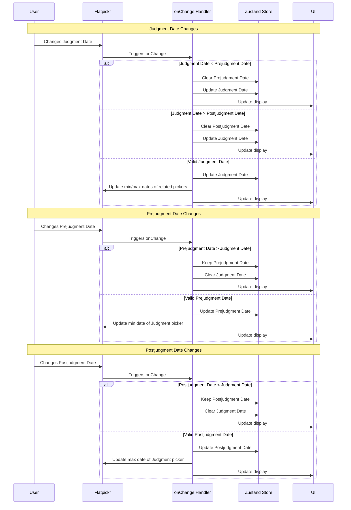

# Simplified Datepicker Implementation

This document outlines a simplified approach for implementing datepicker functionality using Flatpickr, with a focus on handling date constraints properly while keeping the implementation as clean as possible.

## Core Principles

1. **Keep It Simple**: Minimize custom code and leverage Flatpickr's built-in capabilities
2. **Clear Constraints**: Judgment Date must be between Prejudgment Date and Postjudgment Date
3. **Automatic Clearing**: When constraints are violated, clear the dependent fields rather than showing errors

## System Architecture

```mermaid
graph TD
    subgraph "Simplified Date Input System"
        A[HTML Date Inputs] --> |initialized with| B(Flatpickr Instance)

        subgraph "Flatpickr Configuration"
            B -- options --> C1[onChange Handler]
            B -- options --> C2[minDate/maxDate Options]
            B -- options --> C3[allowInput: true]
            B -- options --> C4[dateFormat: "Y-m-d"]
        end

        subgraph "Core Logic"
            D[Update State (Zustand)]
            E[Update Related Pickers' Constraints]
            F[Trigger Recalculation]
            G[Clear Dependent Fields if Needed]
        end

        C1 --> D
        C1 --> E
        C1 --> G
        D --> F
        E --> B
        G --> D
    end

    subgraph "Date Field Relationships"
        JD[Judgment Date Picker]
        PJ[Prejudgment Date Picker]
        PT[Postjudgment Date Picker]
        
        PJ -- "must be before" --> JD
        JD -- "must be after" --> PJ
        JD -- "must be before" --> PT
        PT -- "must be after" --> JD
        
        JD -- "if changed & < PJ date, clear" --> PJ
        JD -- "if changed & > PT date, clear" --> PT
    end

    style B fill:#f9f,stroke:#333,stroke-width:2px
    style C1 fill:#ccf,stroke:#333,stroke-width:1px
    style G fill:#ff9,stroke:#333,stroke-width:2px
```

## Event Flow



## Implementation Example

```javascript
// Initialize the datepickers
const judgmentDatePicker = flatpickr("#judgment-date", {
  allowInput: true,
  dateFormat: "Y-m-d",
  onChange: onJudgmentDateChange
});

const prejudgmentDatePicker = flatpickr("#prejudgment-date", {
  allowInput: true,
  dateFormat: "Y-m-d",
  onChange: onPrejudgmentDateChange
});

const postjudgmentDatePicker = flatpickr("#postjudgment-date", {
  allowInput: true,
  dateFormat: "Y-m-d",
  onChange: onPostjudgmentDateChange
});

// Handle Judgment Date changes
function onJudgmentDateChange(selectedDates) {
  const judgmentDate = selectedDates[0];
  
  // Get current values from other pickers
  const prejudgmentDate = prejudgmentDatePicker.selectedDates[0];
  const postjudgmentDate = postjudgmentDatePicker.selectedDates[0];
  
  // Update state with new judgment date
  store.setState({ judgmentDate });
  
  // Apply constraint rules
  if (prejudgmentDate && judgmentDate < prejudgmentDate) {
    // Clear prejudgment date if judgment date is earlier
    prejudgmentDatePicker.clear();
    store.setState({ prejudgmentDate: null });
  } else if (postjudgmentDate && judgmentDate > postjudgmentDate) {
    // Clear postjudgment date if judgment date is later
    postjudgmentDatePicker.clear();
    store.setState({ postjudgmentDate: null });
  }
  
  // Update constraints on other pickers
  updateDatePickerConstraints();
  
  // Trigger recalculation
  recalculateValues();
}

// Handle Prejudgment Date changes
function onPrejudgmentDateChange(selectedDates) {
  const prejudgmentDate = selectedDates[0];
  const judgmentDate = judgmentDatePicker.selectedDates[0];
  
  // Update state
  store.setState({ prejudgmentDate });
  
  // Apply constraint rules
  if (judgmentDate && prejudgmentDate > judgmentDate) {
    // Clear judgment date if prejudgment date is later
    judgmentDatePicker.clear();
    store.setState({ judgmentDate: null });
  }
  
  // Update constraints
  updateDatePickerConstraints();
  
  // Trigger recalculation
  recalculateValues();
}

// Handle Postjudgment Date changes
function onPostjudgmentDateChange(selectedDates) {
  const postjudgmentDate = selectedDates[0];
  const judgmentDate = judgmentDatePicker.selectedDates[0];
  
  // Update state
  store.setState({ postjudgmentDate });
  
  // Apply constraint rules
  if (judgmentDate && postjudgmentDate < judgmentDate) {
    // Clear judgment date if postjudgment date is earlier
    judgmentDatePicker.clear();
    store.setState({ judgmentDate: null });
  }
  
  // Update constraints
  updateDatePickerConstraints();
  
  // Trigger recalculation
  recalculateValues();
}

// Update the min/max constraints on all pickers
function updateDatePickerConstraints() {
  const { judgmentDate, prejudgmentDate, postjudgmentDate } = store.getState();
  
  // Set constraints based on current values
  if (judgmentDate) {
    // Prejudgment date must be before judgment date
    prejudgmentDatePicker.set("maxDate", judgmentDate);
    
    // Postjudgment date must be after judgment date
    postjudgmentDatePicker.set("minDate", judgmentDate);
  }
  
  if (prejudgmentDate) {
    // Judgment date must be after prejudgment date
    judgmentDatePicker.set("minDate", prejudgmentDate);
  }
  
  if (postjudgmentDate) {
    // Judgment date must be before postjudgment date
    judgmentDatePicker.set("maxDate", postjudgmentDate);
  }
}

// Function to recalculate values based on dates
function recalculateValues() {
  // Implementation depends on your specific calculation needs
  // ...
}
```

## Benefits of this Approach

1. **Simplicity**: Uses Flatpickr's built-in capabilities without unnecessary custom event listeners
2. **Clear Rules**: Has explicit handling for constraint violations
3. **User-Friendly**: Automatically clears dependent fields instead of showing errors
4. **Maintainability**: Centralizes date constraint logic in specific handlers
5. **Robustness**: Prevents invalid date combinations

This implementation focuses on keeping the code clean and straightforward while properly handling all the required date constraints.