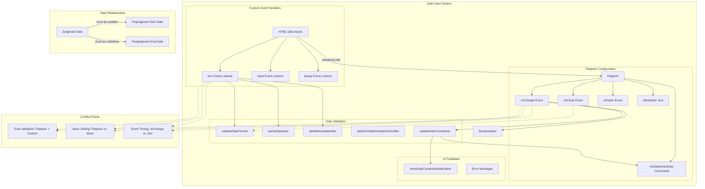

# Datepicker Implementation Diagrams

## System Interaction Diagram



## Event Sequence Diagram

```mermaid
sequenceDiagram
    participant User
    participant DateInput
    participant Flatpickr
    participant CustomHandlers
    participant ValidationUtils
    participant UI
    
    Note over User,UI: Calendar Selection Flow
    User->>DateInput: Clicks on input
    DateInput->>Flatpickr: Triggers onOpen
    Flatpickr->>UI: Positions calendar
    User->>Flatpickr: Selects date from calendar
    Flatpickr->>ValidationUtils: Calls onChange with selectedDates
    ValidationUtils->>ValidationUtils: Validates constraints
    alt Valid Date
        ValidationUtils->>DateInput: Updates input value
        ValidationUtils->>UI: Triggers recalculation
    else Invalid Date
        ValidationUtils->>DateInput: Clears input
        ValidationUtils->>UI: Shows constraint notification
    end
    
    Note over User,UI: Manual Input Flow
    User->>DateInput: Types date manually
    DateInput->>CustomHandlers: Triggers input event
    CustomHandlers->>DateInput: Auto-formats (adds hyphens)
    User->>DateInput: Leaves field (blur)
    DateInput->>Flatpickr: Triggers onClose
    Flatpickr->>ValidationUtils: Validates format & constraints
    alt Valid Format & Constraints
        ValidationUtils->>DateInput: Keeps/formats value
        ValidationUtils->>UI: Triggers recalculation
    else Invalid Format
        ValidationUtils->>DateInput: Clears input
        ValidationUtils->>UI: Shows format error
    else Invalid Constraint
        ValidationUtils->>DateInput: Clears input
        ValidationUtils->>UI: Shows constraint error
    end
    
    Note over User,UI: Judgment Date Change Flow
    User->>DateInput: Changes Judgment Date
    DateInput->>Flatpickr: Triggers onChange
    Flatpickr->>ValidationUtils: Calls updateDateConstraints
    ValidationUtils->>Flatpickr: Updates min/max dates for other pickers
    ValidationUtils->>ValidationUtils: Checks existing dates against new constraints
    alt Other Dates Now Invalid
        ValidationUtils->>DateInput: Clears affected inputs
        ValidationUtils->>UI: Shows constraint notifications
    end
    ValidationUtils->>UI: Triggers recalculation
