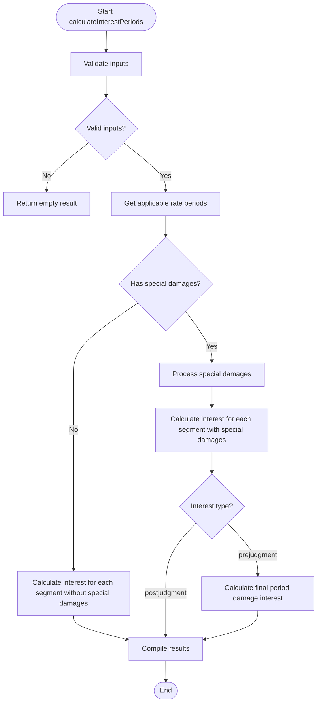

# Simplified Interest Calculation Flow Overview

The following diagram illustrates the proposed simplified approach to interest calculations without detailed subgraphs:

## Key Improvements in This Flow

**Early Special Damages Check**: We check if special damages exist before processing them, avoiding unnecessary work.

**Separate Calculation Paths**: Different paths for scenarios with and without special damages improve clarity and efficiency.

**Conditional Special Damage Interest Calculation**: Special damage interest is only calculated when both:

*   The interest type is prejudgment
*   Special damages actually exist

**Logical Sequence**: The flow follows a more intuitive sequence that matches the business logic.

## Special Damages Handling

The flow preserves the important nuance in how special damages are handled:

**Regular Periods**: In most periods, special damages are lumped together and added to the principal for the next segment. This is handled in the "Calculate interest for each segment with special damages" step.

**Final Period Before Judgment**: For special damages that occur in the final period before judgment, each special damage has interest calculated separately. This special handling is represented in the "Calculate final period damage interest" step.

This distinction is crucial for accurate interest calculations, as it reflects the business rule that special damages in the final period are treated differently from those in earlier periods.

## Implementation Benefits

**Improved Efficiency**: Avoiding unnecessary processing when special damages don't exist.

**Better Readability**: The flow is easier to understand and follow.

**Reduced Complexity**: Early condition checking simplifies the overall flow.

**Maintainability**: The code better reflects the business logic of the calculation.

**Preserved Business Rules**: The special handling of damages in the final period is maintained, ensuring accurate calculations.
