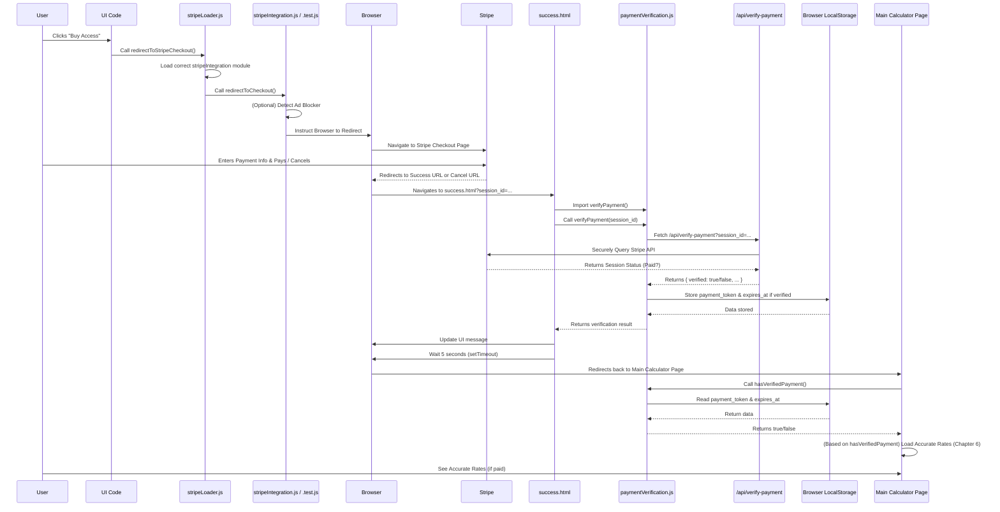

# Chapter 5: Payment Integration (Stripe)

Welcome back! In [Chapter 4: State Management (Zustand Store)](04_state_management__zustand_store__.md), we learned how the calculator keeps all its important information (your inputs, the results, etc.) organized in a central "brain" or "store." This store is crucial for different parts of the application to access the same, up-to-date data.

Now, let's talk about a special feature of the `coi-calculator`: accessing highly accurate, historical interest rate data. While the calculator provides approximate rates for free, getting the *exact* historical rates often requires a small payment. This is where **Payment Integration (Stripe)** comes in.

Think of this feature like buying a premium feature in an app. You click a button, you're taken to a secure place to pay, and if the payment is successful, the app "unlocks" the feature. In our case, the "feature" is access to the precise interest rate data needed for official court calculations.

This chapter is all about understanding how the calculator handles this payment process using **Stripe**, a popular and secure online payment service. We'll see how the calculator:

*   Gets ready to talk to Stripe.
*   Sends you to Stripe's secure payment page.
*   Knows what happened after you pay (or cancel).
*   Handles potential tricky situations, like ad blockers interfering.

### The Online Cashier: Stripe

Stripe acts as our secure online cashier. Instead of the calculator project itself handling sensitive credit card information (which would be very complex and risky!), we hand you off to Stripe. Stripe handles collecting the payment, processing it securely, and then tells our application whether it was successful or not.

### Getting Ready: Loading Stripe

Before we can send a user to Stripe, we need to load Stripe's special JavaScript library into the web page. This library provides the tools our code needs to talk to Stripe.

Remember from [Chapter 1: Application Initialization and Flow](01_application_initialization_and_flow_.md) how the application initializes? Part of that process involves loading external services, and Stripe is one of them. The `stripeLoader.js` module is responsible for this.

A neat trick here is that the project uses different Stripe configurations for testing (development) and the actual website (production). `stripeLoader.js` dynamically loads the correct setup based on whether the application is in test mode or live mode.

Here's a simplified look at how `stripeLoader.js` initializes Stripe:

```javascript
// Inside stripeLoader.js (Simplified)

import { isTestMode } from './mode-manager.js'; // From Chapter 1

/**
 * Load the appropriate Stripe integration module (test or production).
 */
export async function loadStripeIntegration() {
  if (isTestMode()) {
    console.log('Loading test Stripe integration');
    return await import('./stripeIntegration.test.js'); // Load test setup
  } else {
    console.log('Loading production Stripe integration');
    return await import('./stripeIntegration.js'); // Load production setup
  }
}

/**
 * Initialize Stripe with the appropriate integration module.
 */
export async function initializeStripe() {
  // Load the correct module
  const stripeModule = await loadStripeIntegration();

  // The loaded module (either test or production) has an initStripe function
  // Call it to set up Stripe with the correct keys
  const success = stripeModule.initStripe();

  return { initialized: success };
}

// This initializeStripe function is called during app initialization (Chapter 1)
```

This code waits for the correct `stripeIntegration` file (either `.test.js` or `.js`) to load and then calls its `initStripe` function. The `initStripe` function (inside those specific files) uses the loaded Stripe library (`Stripe()`) and the correct "publishable key" to get Stripe ready for transactions.

### Going to the Cashier: Starting the Checkout

When a user clicks the button to buy access, the application needs to initiate the payment process with Stripe. This is handled by the `redirectToStripeCheckout` function, which is also provided by the loaded `stripeIntegration.js` (or `.test.js`) module and exposed by `stripeLoader.js`.

This function doesn't show a payment form *on* our calculator page. Instead, it tells the browser to go *to* a secure payment page hosted by Stripe.

```javascript
// Inside stripeLoader.js (Simplified)

// ... (initializeStripe and loadStripeIntegration functions) ...

/**
 * Redirect the user to the Stripe-hosted checkout page.
 */
export async function redirectToStripeCheckout() {
  // Load the correct integration module again if needed (or assume it's loaded)
  const stripeModule = await loadStripeIntegration();

  // Call the redirectToCheckout function from the loaded module
  // This function handles talking to Stripe and redirecting the browser
  return stripeModule.redirectToCheckout();
}

// This function is called when the user clicks the 'Buy Access' button
```

Now let's look at a simplified version of `redirectToCheckout` inside one of the `stripeIntegration` files:

```javascript
// Inside stripeIntegration.js (Simplified redirectToCheckout)

// ... (Stripe key, price ID, etc.) ...

export async function redirectToCheckout() {
  try {
    // Use the Stripe instance initialized earlier
    // Tell Stripe to redirect the user to a checkout session
    const { error } = await stripe.redirectToCheckout({
      lineItems: [ // What the user is buying
        { price: PRODUCT_PRICE_ID, quantity: 1 } // Our product price ID
      ],
      mode: 'payment', // It's a one-time payment
      successUrl: 'https://ourwebsite.com/success.html?session_id={CHECKOUT_SESSION_ID}', // Where to send the user after success
      cancelUrl: 'https://ourwebsite.com/cancel.html', // Where to send the user if they cancel
      allowPromotionCodes: true, // Allow coupons
    });

    if (error) {
      // If there was an error initiating the redirect, log it and fall back
      console.error('Stripe checkout error:', error);
      // Fallback: Redirect to a pre-configured direct payment link
      window.location.href = PAYMENT_LINK;
    }
  } catch (error) {
    console.error('General error initiating checkout:', error);
    // Fallback for any unexpected errors
    window.location.href = PAYMENT_LINK;
  }
}
```

When `redirectToStripeCheckout` is called, this code runs:
1.  It tells the browser to display a loading indicator (`showLoadingIndicator` - not shown above, but present in the actual code) to show something is happening.
2.  It calls `stripe.redirectToCheckout`, which is a function provided by Stripe's library. This function requires details about what is being bought (`lineItems`), the type of transaction (`mode`), and importantly, the URLs where Stripe should send the user *after* the payment process is finished (either successfully or cancelled).
3.  If Stripe's redirect process encounters an error (sometimes caused by things like ad blockers), the code includes a fallback: it simply sends the user directly to a pre-configured Stripe payment link (`PAYMENT_LINK`) which bypasses some of the client-side JavaScript and is more robust.

After this, the user is on Stripe's secure page. Our application is now waiting for Stripe to send the user back.

### What Happens Next: Success and Cancel Pages

Stripe will redirect the user back to the `successUrl` or `cancelUrl` specified in the `redirectToCheckout` call.

#### The Cancel Page (`cancel.html`)

If the user cancels the payment on Stripe's site, they are sent to `cancel.html`. This is a simple static page with a message like "Payment Cancelled" and links to return to the calculator or try again.

```html
<!-- Inside cancel.html (Simplified) -->
<!DOCTYPE html>
<html>
<head>...</head>
<body>
  <div class="cancel-container">
    <h1>Payment Cancelled</h1>
    <p>Your payment was cancelled.</p>
    <a href="/" id="return-button">Return to Calculator</a>
    <a href="#" id="retry-payment">Try Again</a> <!-- Calls redirectToStripeCheckout via script -->
  </div>
  <script type="module">
      import { redirectToStripeCheckout } from './stripeLoader.js'; // Import the redirect function

      document.addEventListener('DOMContentLoaded', () => {
          // ... logic to set the return button URL based on mode ...

          // Add click listener to the Retry button
          document.getElementById('retry-payment').addEventListener('click', (e) => {
              e.preventDefault(); // Stop the default link behavior
              redirectToStripeCheckout(); // Call our redirect function
          });
      });
  </script>
</body>
</html>
```

The important part here is the script that imports `redirectToStripeCheckout` and calls it if the user clicks "Try Again."

#### The Success Page (`success.html`)

If the payment is successful on Stripe's site, the user is redirected to `success.html`. This page is more complex because it needs to do two crucial things:

1.  **Verify the Payment:** It needs to confirm that the payment was *actually* successful and not just a user manually navigating to this page.
2.  **Unlock Access:** If verified, it needs to store proof of payment so the main calculator page knows to load the accurate rates.

Stripe helps with the first step by including a `session_id` parameter in the URL when it redirects to the success page (e.g., `https://ourwebsite.com/success.html?session_id=cs_test_...`). This `session_id` identifies the specific checkout session that just completed.

### Confirming the Payment: Verification

Simply landing on `success.html` isn't proof of payment. A malicious user could just type that URL. We need to take the `session_id` from the URL and send it to our server to verify it directly with Stripe's API. This server-to-server communication is secure and cannot be faked by a user.

The `paymentVerification.js` module handles this verification logic.

```javascript
// Inside paymentVerification.js (Simplified)

import { isTestMode } from './mode-manager.js'; // From Chapter 1

// Define the URL for our serverless function that verifies payments
const VERIFY_API_URL = 'https://www.courtorderinterestcalculator.com/api/verify-payment'; // This is a Netlify Function

/**
 * Verify payment with the serverless function using the Stripe session ID.
 */
export async function verifyPayment(sessionId) {
  if (!sessionId) {
    console.error('No session ID provided for verification');
    throw new Error('No session ID');
  }

  try {
    // Make a request to our secure backend API endpoint
    const response = await fetch(`${VERIFY_API_URL}?session_id=${encodeURIComponent(sessionId)}`);

    if (!response.ok) {
      // Handle server errors
      const errorText = await response.text();
      console.error('Server error response:', errorText);
      throw new Error(`Verification failed: ${response.status}`);
    }

    const data = await response.json(); // Expect JSON response

    if (data.verified) {
      // If the API says it's verified, store proof in localStorage
      const storageKey = isTestMode() ? 'test_payment_token' : 'payment_token';
      const expiresKey = isTestMode() ? 'test_payment_expires_at' : 'payment_expires_at';

      localStorage.setItem(storageKey, data.token); // Store a verification token
      localStorage.setItem(expiresKey, data.expiresAt); // Store expiration time

      return { success: true, message: 'Payment verified!' };
    } else {
      // If the API says it's NOT verified (even if payment succeeded), treat as failure
      return { success: false, message: data.error || 'Verification failed' };
    }
  } catch (error) {
    console.error('Payment verification error:', error);
    throw error; // Propagate the error
  }
}
```

The script on `success.html` imports this `verifyPayment` function, extracts the `session_id` from the URL, and calls `verifyPayment(sessionId)`.

If `verifyPayment` is successful (meaning our server verified the session ID with Stripe and Stripe confirmed the payment), it stores a "payment token" and an "expiration timestamp" in the browser's `localStorage`. This `localStorage` item is the proof of payment that the *main* calculator page will look for later.

```javascript
// Inside success.html <script> (Simplified)

import { verifyPayment } from './paymentVerification.js'; // Import verification logic

document.addEventListener('DOMContentLoaded', async () => {
    // ... (Set up return button link) ...

    try {
        const urlParams = new URLSearchParams(window.location.search);
        const sessionId = urlParams.get('session_id'); // Get session ID from URL

        if (sessionId) {
            // Attempt to verify the session server-side
            let result = await verifyPayment(sessionId);

            if (result.success) {
                // Verification successful! Update UI message.
                document.getElementById('payment-status').innerHTML = '<p>Payment verified successfully!</p>';
                // localStorage has been updated by verifyPayment()
            } else {
                // Verification failed, show error message.
                 document.getElementById('payment-status').innerHTML = '<p>Payment verification failed: ' + result.message + '</p>';
                 // Still store proof as fallback, Stripe usually doesn't redirect on failure
                 // (In the real code, a client-side fallback is used if server verification fails)
            }
        } else {
             // Handle case where no session_id is in URL (e.g., manual page load, testing)
             document.getElementById('payment-status').innerHTML = '<p>No session ID found. Cannot verify payment automatically.</p>';
             // A test/dev fallback might be triggered here in the actual code
        }

    } catch (error) {
        console.error('Error in success page:', error);
        document.getElementById('payment-status').innerHTML = '<p>An error occurred during verification.</p>';
    }

    // After verification attempt, redirect back to the calculator page after a delay
    setTimeout(() => {
        // Redirect back to the main page or test page based on mode
        const isTestMode = window.location.pathname.includes('/test');
        window.location.href = isTestMode ? '/test' : '/';
    }, 5000); // Redirect after 5 seconds
});
```

After attempting verification and updating the `localStorage`, the `success.html` page uses `setTimeout` to automatically redirect the user back to the main calculator page (`/` or `/test`).

### Checking for Payment on the Main Page

Back on the main calculator page, when the application loads, it needs to know if the user has paid for accurate rates. It checks for the presence and validity of the payment token stored in `localStorage` by the `success.html` page.

The `paymentVerification.js` module also provides a function for this: `hasVerifiedPayment()`.

```javascript
// Inside paymentVerification.js (Simplified)

/**
 * Check if user has a valid payment token stored in localStorage.
 */
export function hasVerifiedPayment() {
  const storageKey = isTestMode() ? 'test_payment_token' : 'payment_token';
  const expiresKey = isTestMode() ? 'test_payment_expires_at' : 'payment_expires_at';

  const token = localStorage.getItem(storageKey);
  const expiresAt = localStorage.getItem(expiresKey);

  // Check if token exists AND the expiration time is in the future
  const isValid = token && expiresAt && (parseInt(expiresAt) > Date.now());

  return isValid;
}
```

This `hasVerifiedPayment()` function is used by the rate loading logic ([Chapter 6: Interest Rate Data Management](06_interest_rate_data_management_.md)). If it returns `true`, the application knows it can try to load the premium accurate rates; otherwise, it loads the free approximate rates.

### Handling Ad Blockers

One common issue with payment integrations is interference from ad blockers. Ad blockers often block requests to domains associated with tracking or analytics, and sometimes this can accidentally block parts of Stripe's JavaScript or network requests, preventing the `redirectToCheckout` function from working correctly.

The `coi-calculator` project includes logic to detect potential ad blockers and provide a fallback:

1.  **Detection:** The `initStripe` function within `stripeIntegration.js` (and `.test.js`) includes a `detectAdBlocker` function. This function tries to load small, hidden resources (like dummy images or fetch requests) from domains commonly blocked by ad blockers (like Google Ads or Google Analytics). If these requests fail, it assumes an ad blocker is present and sets an internal flag `adBlockerDetected`.
2.  **Fallback:** The `redirectToCheckout` function checks the `adBlockerDetected` flag (and whether Stripe initialized correctly). If an issue is detected, it skips attempting the programmatic redirect via `stripe.redirectToCheckout` and instead immediately sends the user to the direct Stripe `PAYMENT_LINK`. This link is configured in the Stripe dashboard and often bypasses client-side blocking issues.
3.  **User Warning:** The `ad-blocker-handler.js` module, which uses the `isAdBlockerDetected()` function exposed by `stripeIntegration.js`, checks this flag when the page loads. If an ad blocker is detected and the user hasn't dismissed the warning before, it displays a message on the page advising the user that ad blockers might cause issues with payment and suggests using the direct link or temporarily disabling the blocker.

Here's a look at the ad blocker detection (simplified):

```javascript
// Inside stripeIntegration.js (Simplified detectAdBlocker)

let adBlockerDetected = false;

function detectAdBlocker() {
  // Try loading an image from a blocked domain
  const testImg = document.createElement('img');
  testImg.style.display = 'none';
  testImg.onerror = () => { adBlockerDetected = true; }; // If it fails, assume blocker
  testImg.onload = () => { adBlockerDetected = false; testImg.remove(); }; // If it loads, no blocker
  testImg.src = 'https://pagead2.googlesyndication.com/pagead/js/adsbygoogle.js'; // Common blocked URL
  document.body.appendChild(testImg);

  // Also listen for unhandled network errors that might be blocked requests
  window.addEventListener('unhandledrejection', event => {
      if (event.reason && (event.reason.message && event.reason.message.includes('Failed to fetch'))) {
          // This is likely a blocked fetch request
          event.preventDefault(); // Prevent console error
          adBlockerDetected = true; // Set the flag
      }
  });
}

export function isAdBlockerDetected() {
    return adBlockerDetected;
}

// detectAdBlocker is called inside initStripe()
```

This proactive handling of ad blockers improves the robustness of the payment process, ensuring that users are either redirected successfully or informed about potential issues and given an alternative method (the direct link).

### The Payment Flow Visualized

Let's put the key steps involving Stripe together in a simplified diagram:



This diagram illustrates the journey: starting the checkout, going to Stripe, coming back, verifying the payment securely with a server step, storing the proof, and finally returning to the main page where the payment status is checked to unlock features.

### Summary of Key Payment Files

Here's a quick rundown of the main files involved in the Stripe integration:

| File Name                     | Primary Role                                      | Key Responsibilities                                                                    |
| :---------------------------- | :------------------------------------------------ | :-------------------------------------------------------------------------------------- |
| `stripeLoader.js`             | Dynamic loading and interface                     | Loads test/production Stripe integration, exposes `redirectToStripeCheckout`.             |
| `stripeIntegration.js`        | Production Stripe implementation                | Initializes Stripe with live key, implements `redirectToCheckout` with live URLs/IDs. |
| `stripeIntegration.test.js`   | Test Stripe implementation                      | Initializes Stripe with test key, implements `redirectToCheckout` with test URLs/IDs. |
| `cancel.html`                 | User-facing page after cancelled payment          | Displays cancellation message, links back to calculator. Imports `redirectToStripeCheckout` for retry. |
| `success.html`                | User-facing page after successful payment         | Displays success message, gets session ID, calls verification logic, redirects back.    |
| `paymentVerification.js`      | Payment verification and status check             | Sends session ID to backend API, stores verification in `localStorage`, `hasVerifiedPayment` function. |
| `/api/verify-payment` (Backend) | Secure Serverless Function (not in JS project) | Communicates with Stripe API server-to-server to confirm payment status based on session ID. |
| `ad-blocker-handler.js`       | Ad Blocker User Notification                      | Uses `isAdBlockerDetected` to show a warning about potential payment issues.            |

### Conclusion

In this chapter, we've walked through the payment integration process using Stripe. We saw how the application loads the necessary Stripe tools, redirects the user to Stripe's secure site for payment, and then handles the outcome on dedicated success or cancel pages. A key part is the secure verification step on the `success.html` page using a backend API and the `paymentVerification.js` module, which ultimately stores proof of payment in `localStorage`. We also looked at how the project tries to work around potential issues like ad blockers.

Knowing whether a user has a verified payment is essential for the next step: getting the accurate interest rates needed for precise calculations. In the next chapter, we'll dive into [Interest Rate Data Management](06_interest_rate_data_management_.md), exploring how the calculator fetches, uses, and manages the historical rate data.

[Interest Rate Data Management](06_interest_rate_data_management_.md)