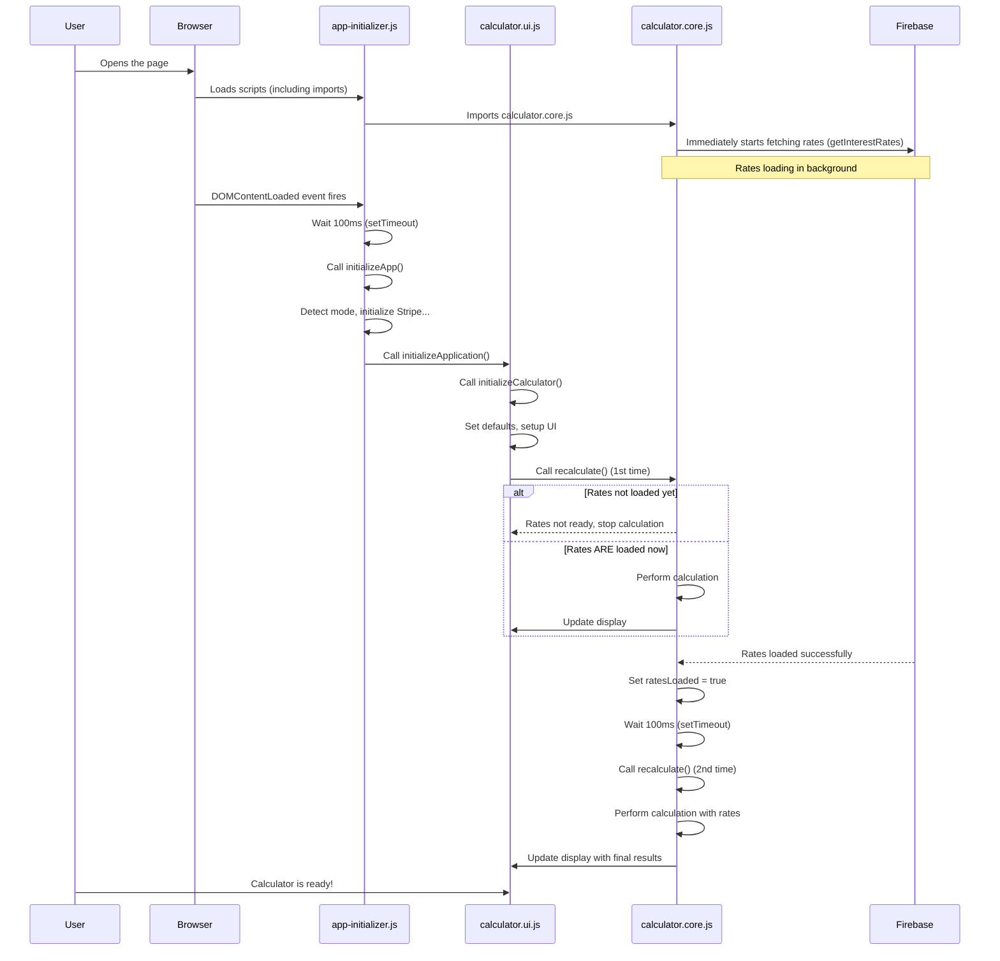

# Chapter 1: Application Initialization and Flow

Welcome to the tutorial for the `coi-calculator` project! We're going to explore how this application works, starting from the very beginning: how it wakes up and gets ready when you open it in your browser.

Think of the application like a play. Before the actors can perform and the story can unfold, the director needs to set up the stage, make sure the lighting and sound are ready, and get the actors into position. This first chapter is all about that setup process – getting the "stage" (the web page) ready, loading necessary "props" (data and external services), and giving the initial instructions to the "actors" (different parts of the calculator code).

The main goal of this chapter is to understand how the calculator goes from a blank page to a ready-to-use tool displaying an initial calculation, all thanks to this "Initialization and Flow" process.

### The Director: `app-initializer.js`

At the heart of the startup process is the `app-initializer.js` file. This is like our project's main director. Its job is to make sure everything necessary is in place *before* you can start interacting with the calculator.

What kind of things need to be ready?

*   **Knowing the "Environment":** Is this the real calculator on the official website (live mode), or is it a version being tested by developers (test mode)? This is important because some features, like connecting to payment systems, might behave differently.
*   **Getting Essential Tools:** The calculator needs to potentially interact with services like Stripe for payments (though payment is covered in a later chapter). The initializer makes sure these services are loaded and ready *if* they are needed.
*   **Fetching Important Information:** The calculator needs current and historical interest rates to perform calculations. This data needs to be fetched, usually from a database like Firebase (covered in [Interest Rate Data Management
    ](06_interest_rate_data_management_.md)).
*   **Setting the Stage Appearance:** The initial look of the calculator, like which sections are shown or hidden, and setting default values in the input fields.

Let's look at the core function in `app-initializer.js`:

```javascript
// Inside app-initializer.js

import { initializeModeManager, isTestMode, setTestMode, addTestModeIndicator } from './mode-manager.js';
import { initializeStripe } from './stripeLoader.js';

/**
 * Initialize the application
 * @returns {Promise<void>}
 */
export async function initializeApp() {
  try {
    console.log('Initializing application...');

    // ... (URL param checks omitted for brevity)

    // First, initialize the mode manager to detect test vs. live mode
    await initializeModeManager();

    // If in test mode, add visual indicator
    if (isTestMode()) {
      console.log('Running in TEST MODE');
      addTestModeIndicator();
    } else {
      console.log('Running in LIVE MODE');
    }

    // Initialize Stripe with the appropriate integration
    const stripeResult = await initializeStripe();

    if (stripeResult.initialized) {
      console.log('Stripe initialized successfully');
    } else {
      console.warn('Stripe initialization failed, fallback methods will be used');
    }

    // ... (error handling and return value omitted)

  } catch (error) {
    console.error('Application initialization error:', error);
  }
}
```

This `initializeApp` function does some crucial things:
1.  It calls `initializeModeManager()` to figure out if we are in test or live mode.
2.  Based on the mode, it might show a visual indicator (like a "TEST MODE" banner).
3.  It calls `initializeStripe()` to load the Stripe payment library.

This function is called when the web page's content is fully loaded:

```javascript
// Inside app-initializer.js

// Initialize the app when this module is loaded and DOM content is ready
document.addEventListener('DOMContentLoaded', async () => {
  console.log('DOM content loaded, initializing app...');

  // Wait a short time to ensure other scripts have loaded (a common practice)
  setTimeout(async () => {
    try {
      const result = await initializeApp();
      console.log('App initialization result:', result);

      // After core app init, trigger the UI initialization
      // This relies on calculator.ui.js being imported elsewhere
      // and exposing its initializeApplication function.
      // (Note: The code structure implies initializeApplication is
      // called separately after app init results are logged)

    } catch (error) {
      console.error('Error during app initialization:', error);
    }
  }, 100); // Waits 100ms
});
```

This part listens for the `DOMContentLoaded` event, which is the browser's signal that the basic structure of the page (the HTML elements) is ready. It then waits a tiny bit (`setTimeout`) before calling `initializeApp` to give everything a moment to settle.

### The Stage Manager: `calculator.ui.js`

Once the `app-initializer.js` director has handled the high-level setup (mode, Stripe), it's time for the "Stage Manager," represented by `calculator.ui.js`. This module is responsible for:

*   Setting the initial look of the calculator form.
*   Placing default values into the input fields.
*   Setting up all the interactive parts (event listeners) so the calculator reacts when you type or click.
*   Performing the *very first* calculation using the default values.

This is handled by the `initializeCalculator` function within `calculator.ui.js`:

```javascript
// Inside calculator.ui.js

import { recalculate } from './calculator.core.js';
import {
    elements, // References to HTML elements
    setDefaultInputValues,
    // ... (other UI related imports)
} from './domUtils.js';
import useStore from './store.js'; // State Management (covered in Chapter 4)

/**
 * Initializes the calculator when the DOM is fully loaded.
 */
function initializeCalculator() {
    // 1. Check if essential parts of the stage (DOM elements) are present
    // ... (element presence check omitted)

    // 2. Set default starting values in the input fields
    setDefaultInputValues();

    // 3. Setup all the interaction points (event listeners)
    setupEventListeners();

    // 4. Set the initial visibility of different sections (Prejudgment, Postjudgment, Per Diem)
    togglePrejudgmentVisibility(true, null); // Show prejudgment by default
    togglePostjudgmentVisibility(true, null); // Show postjudgment by default
    togglePerDiemVisibility(true, null); // Show per diem by default

    // 5. Initialize the central data storage with defaults (covered in Chapter 4)
    const defaultInputs = { /* ... default input values ... */ };
    const defaultSpecialDamages = [ /* ... example damages ... */ ];
    const defaultResults = { /* ... initial empty results ... */ };

    useStore.getState().initializeStore({
        inputs: defaultInputs,
        results: defaultResults
    });

    // 6. Update the display with the initial defaults and calculate the very first results
    updateSummaryTable(useStore, recalculate); // Populate summary & setup listeners
    recalculate(); // Perform the initial calculation

    // ... (other initializations like pagination, clear button)
}

/**
 * Initializes the application with error handling (called after app-initializer.js logic).
 */
async function initializeApplication() {
  try {
    // Listen for specific errors (e.g., from Firebase rate loading)
    // ... (error listener setup omitted)

    // Initialize the calculator UI and flow
    initializeCalculator();

  } catch (error) {
    console.error('Failed to initialize application:', error);
    // Show a general error to the user
  }
}

// --- Entry Point ---
// This is where the UI initialization starts after DOM is ready.
// It's called by the DOMContentLoaded listener setup, likely in app-initializer.js
// (Note: The provided snippet shows calculator.ui.js setting up its *own*
// DOMContentLoaded listener calling initializeApplication. The final application
// structure might have one central listener in app-initializer calling this.)
document.addEventListener('DOMContentLoaded', initializeApplication);

```

The `initializeCalculator` function is the workhorse for setting up the UI. It performs these key actions:
1.  It checks if all the necessary HTML elements are present on the page.
2.  It calls `setDefaultInputValues()` from `./domUtils.js` to put initial numbers and dates into the calculator's input boxes.
3.  It calls `setupEventListeners()` to make the input boxes and checkboxes responsive.
4.  It calls visibility functions (`togglePrejudgmentVisibility`, etc.) to show or hide parts of the calculator.
5.  It initializes the application's central data storage ([State Management (Zustand Store)
    ](04_state_management__zustand_store__.md)) with these default values.
6.  **Crucially:** It calls `recalculate()` from `./calculator.core.js`. This is the first time the calculation engine runs, using the default values you see when the page loads.

### Fetching Data: `calculator.core.js` and `firebaseIntegration.js`

Another important part of the startup that happens early is loading the interest rates. The calculator *cannot* perform calculations accurately without this data.

The `calculator.core.js` file, which contains the main `recalculate` function, is responsible for using the rate data. When `calculator.core.js` is first loaded by the browser, it immediately tries to fetch the rates:

```javascript
// Inside calculator.core.js

// Import the function to get rates from Firebase
import { getInterestRates } from './firebaseIntegration.js';

// Variable to hold the rates once loaded
let interestRatesData = {};
let ratesLoaded = false; // Flag to track if rates are ready

// Async function to load rates
async function loadRatesFromFirebase() {
    try {
        const result = await getInterestRates();
        interestRatesData = result.rates; // Store the loaded rates
        ratesLoaded = true; // Mark rates as loaded

        // After rates are loaded, trigger a recalculation
        if (typeof window !== 'undefined') {
            setTimeout(() => {
                recalculate(); // Call recalculate once rates are available
            }, 100); // Wait a moment
        }
        return true;
    } catch (error) {
        console.error("Error loading Firebase rates:", error);
        // Propagate the error or handle it
        throw error;
    }
}

// Trigger Firebase rate loading AS SOON AS this module is imported
loadRatesFromFirebase().catch(error => {
    console.error("Failed to load interest rates from Firebase:", error);
    // Show a user-friendly alert
    alert("Error: Could not load interest rates from Firebase. Please check your internet connection and try again.");
});

// ... (recalculate function and other code below)

```

This snippet shows that as soon as the browser loads `calculator.core.js` (which happens early in the page load process), it calls `loadRatesFromFirebase()`. This starts the process of fetching data from Firebase in the background, independently of the `DOMContentLoaded` event.

Notice that *after* the rates successfully load, it calls `recalculate()` again using `setTimeout`. This is important! The first time `recalculate()` is called by `initializeCalculator`, the rates might *not* be ready yet. If they aren't, `recalculate` will see the `ratesLoaded` flag is false and simply stop without performing calculations. Once the `loadRatesFromFirebase` function finishes and sets `ratesLoaded = true`, it triggers a *second* `recalculate()`, which will now have the data it needs to complete successfully.

### The Flow Visualized

Let's put it all together in a simplified sequence:



This diagram shows how different parts of the application work together from the moment the page starts loading. The `app-initializer.js` kicks off the main process after the page structure is ready, the `calculator.ui.js` sets up the visual elements and interactions, and the `calculator.core.js` starts fetching the data needed for calculations as soon as possible, triggering a recalculation once that data is available.

### Conclusion

In this chapter, we learned about the critical first steps the calculator takes when you open it. The `app-initializer.js` acts as the main director, ensuring the application environment is set up and external services are ready. The `calculator.ui.js` module acts as the stage manager, setting up the initial look of the calculator, adding default values, and preparing it for user interaction. Crucially, these initial steps include triggering the loading of essential data like interest rates and performing the first calculation so the user sees results immediately.

This sets the stage (literally!) for the user to interact with the calculator. But how does the calculator actually show you the numbers and fields you see on the screen? That's what we'll explore in the next chapter!

[UI Display and DOM Interaction
](02_ui_display_and_dom_interaction_.md)

---

<sub><sup>Generated by [AI Codebase Knowledge Builder](https://github.com/The-Pocket/Tutorial-Codebase-Knowledge).</sup></sub> <sub><sup>**References**: [[1]](https://github.com/Mharbulous/coi-calculator/blob/6fa85820c594929557e5b2e60eeb12bcd27dfcef/BC COIA calculator/app-initializer.js), [[2]](https://github.com/Mharbulous/coi-calculator/blob/6fa85820c594929557e5b2e60eeb12bcd27dfcef/BC COIA calculator/calculator.core.js), [[3]](https://github.com/Mharbulous/coi-calculator/blob/6fa85820c594929557e5b2e60eeb12bcd27dfcef/BC COIA calculator/calculator.ui.js)</sup></sub>