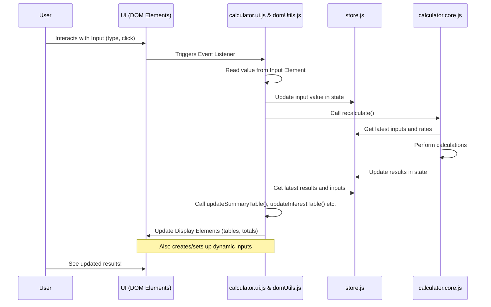

# Chapter 2: UI Display and DOM Interaction

Welcome back! In [Chapter 1: Application Initialization and Flow](01_application_initialization_and_flow_.md), we saw how the calculator project gets itself ready when you open the page – loading data, setting up external services, and putting initial values on the screen.

But how does the calculator actually *show* you those initial values? How does it *know* when you type in a number or change a date? And how does it update the results *right before your eyes*? That's where UI Display and DOM Interaction come in.

Think of the application like a stage play again. Chapter 1 was the director setting up the stage and getting actors ready. This chapter is about the stage itself – the sets, the props, the lights – and how the actors (our code) interact with them. It's also about the audience (you!) interacting with the play (typing in fields, clicking buttons) and how the stage manager (our UI code) reacts to that.

The main goal of this chapter is to understand how our JavaScript code finds specific parts of the web page (like input boxes and tables), puts information into them, and listens for when you interact with them.

### The Stage: The HTML Structure

The calculator you see in your browser is built from HTML elements – these are the building blocks of any web page. They define the input fields, the buttons, the tables, and where everything sits. Our JavaScript needs a way to find these specific blocks.

In this project, we use special attributes called `data-*` attributes to make it easy to identify important elements. For example, an input field for the judgment date might look something like this in the HTML:

```html
<input type="text" data-input="judgmentDate">
```

And a place where a total is displayed might look like this:

```html
<span data-display="summaryTotal"></span>
```

These `data-*` attributes don't affect how the HTML looks by themselves, but they act like labels our JavaScript can read to quickly find the elements it needs to interact with.

### The Property Master: `dom/elements.js`

Instead of searching the entire page every time we need an element, the project has a dedicated file, `dom/elements.js`, that finds all the important elements once when the script loads. It uses `document.querySelector` with our special `data-*` attributes to grab references to these elements and stores them in a single `elements` object.

Here's a simplified look at `dom/elements.js`:

```javascript
// Inside dom/elements.js

// Use data attributes to find elements reliably
const elements = {
    // Input fields
    jurisdictionSelect: document.querySelector('[data-input="jurisdictionSelect"]'),
    judgmentDateInput: document.querySelector('[data-input="judgmentDate"]'),
    showPrejudgmentCheckbox: document.querySelector('[data-input="showPrejudgmentCheckbox"]'),
    // ... and many more inputs

    // Display areas (tables, spans)
    prejudgmentTableBody: document.querySelector('[data-display="prejudgmentTableBody"]'),
    summaryTotalEl: document.querySelector('[data-display="summaryTotal"]'),
    // ... and many more display elements
};

export default elements;
```

This `elements` object is like a handy list of all the important "props" on our stage. Any other part of the code that needs to interact with a specific input or display area can just import this `elements` object and access the required element directly, like `elements.judgmentDateInput`.

### Showing Information: Updating the Display

Once the calculator performs its magic (calculations, covered in [Calculation Engine](07_calculation_engine_.md)), the results need to be shown on the screen. This involves taking numbers and dates and placing them into the correct HTML elements on the page.

The main functions responsible for updating the visible parts of the calculator are `updateSummaryTable` (in `dom/tables.summary.js`) and `updateInterestTable` (in `dom/tables.interest.js`).

Let's look at a super simplified example of how `updateSummaryTable` might add a single row for "General Damages & Debt":

```javascript
// Simplified example logic (not the exact code structure)

import elements from './dom/elements.js';
import { formatCurrencyForDisplay } from '../utils.currency.js'; // Covered in Chapter 3

function updateSummaryTable(inputs, results) {
    // ... clear existing rows ...

    // --- Add row for General Damages & Debt ---
    const summaryTableBody = elements.summaryTableBody;
    const newRow = summaryTableBody.insertRow(); // Add a new row

    // Cell 1: Item Label
    const labelCell = newRow.insertCell();
    const labelSpan = document.createElement('span');
    labelSpan.textContent = 'General Damages & Debt';
    labelCell.appendChild(labelSpan);

    // Cell 2: Date Input (or display)
    const dateCell = newRow.insertCell();
    // In the real code, this cell contains an <input> or <span>
    // Here, we'll show updating a span for simplicity
    const dateDisplay = document.createElement('span');
    // Assume we have a formatted date string
    dateDisplay.textContent = inputs.judgmentDate ? inputs.judgmentDate.toISOString().split('T')[0] : '';
    dateCell.appendChild(dateDisplay);


    // Cell 3: Amount Input (or display)
    const amountCell = newRow.insertCell();
    // In the real code, this cell contains an <input> or <span>
    // Here, we'll show updating a span for simplicity
    const amountDisplay = document.createElement('span');
    // Use a utility to format the number as currency
    amountDisplay.innerHTML = formatCurrencyForDisplay(inputs.judgmentAwarded); // e.g., "$10,000.00"
    amountCell.appendChild(amountDisplay);

    // Add CSS classes for alignment (not shown here for brevity)
    // ... add more rows ...

    // --- Update the total at the bottom ---
    elements.summaryTotalEl.innerHTML = formatCurrencyForDisplay(results.totalOwing);
    elements.summaryPerDiemEl.innerHTML = formatCurrencyForDisplay(results.perDiem);
}
```

This simplified code shows the pattern:
1.  Get a reference to the table body using the `elements` object.
2.  Create new HTML elements (rows `<tr>`, cells `<td>`, spans `<span>`).
3.  Put the calculated data (like the amount) into the `textContent` or `innerHTML` of these elements.
4.  Append the new elements to the table body.
5.  Update the separate total elements below the table in a similar way.

`updateInterestTable` works similarly for the prejudgment and postjudgment tables, creating rows for each period of interest calculation.

### Getting Input: Listening to the Audience

The calculator isn't very useful if it just shows default values. It needs to react when you type in a different amount or select a new date. This is done by adding "event listeners" to the input elements. An event listener is like a little sensor attached to an element that waits for something specific to happen (like someone typing, clicking, or changing a value) and then runs a piece of code.

The `setupEventListeners` function (in `calculator.ui.js`) is where most of these sensors are set up when the calculator starts.

Here's a simplified example focusing on the jurisdiction dropdown:

```javascript
// Inside calculator.ui.js (simplified setupEventListeners function)

import elements from './dom/elements.js';
import useStore from './store.js'; // Covered in Chapter 4
import { recalculate } from './calculator.core.js'; // Covered in Chapter 7

function setupEventListeners() {
    // Listen for changes on the Jurisdiction dropdown
    if (elements.jurisdictionSelect) { // Make sure the element exists
        elements.jurisdictionSelect.addEventListener('change', () => {
            // 1. Get the new value from the input element
            const newJurisdiction = elements.jurisdictionSelect.value;

            // 2. Update the central data storage ([State Management](04_state_management__zustand_store__.md))
            useStore.getState().setInput('jurisdiction', newJurisdiction);

            // 3. Trigger a recalculation
            recalculate();

            // 4. Optionally dispatch an event for other parts of the UI (like pagination)
            document.dispatchEvent(new CustomEvent('content-changed'));
        });
    }

    // ... setup listeners for other inputs like checkboxes ...

    // Note: Listeners for inputs *within* the summary table
    // are added dynamically when the table is updated.
}

// This function is called during initialization (see Chapter 1)
// initializeCalculator(); // Example call flow
```

When you change the jurisdiction, the `change` event fires. The code inside the event listener does three main things:
1.  It reads the *new* value from the `elements.jurisdictionSelect.value`.
2.  It saves this new value in the application's central data storage ([State Management (Zustand Store)](04_state_management__zustand_store__.md)). This is crucial because the calculation engine works with the data in the store, not directly with the values in the HTML inputs.
3.  It calls `recalculate()` to run the calculations again using the newly updated data from the store.

The `recalculate()` function will then fetch the updated data from the store, perform calculations, update the *results* in the store, and finally call the `updateSummaryTable` and `updateInterestTable` functions mentioned earlier to refresh the display with the new numbers.

### Dynamic Inputs in the Summary Table

A slightly more advanced aspect of UI interaction in this project is how the editable fields in the Summary table (like General Damages, Non-pecuniary Damages amounts, and the Prejudgment/Postjudgment dates) are handled.

These fields aren't static HTML elements. Instead, `updateSummaryTable` *creates* the `<tr>` and `<td>` elements for each row, and within those cells, it dynamically creates the `<input>` elements for dates and amounts if the row is editable.

After creating these input elements, `updateSummaryTable` needs to attach event listeners to *them*. This is handled by functions like `setupCurrencyInputListeners` and `setupCustomDateInputListeners` (from `dom/setup.js`).

Here's a simplified look at how a currency input is set up when a summary row is created:

```javascript
// Inside dom/tables.summary.js (simplified loop iteration)

import { setupCurrencyInputListeners } from './setup.js';
// ... other imports ...

items.forEach(item => {
    let rowClone = template.content.cloneNode(true);
    const amountInput = rowClone.querySelector('[data-input="amountValue"]');

    if (amountInput) {
        // Set initial value (e.g., "$10,000.00")
        amountInput.value = formatCurrencyForInputWithCommas(item.amount);

        // Setup currency formatting and blur/enter listeners
        // Pass the recalculate function so it's called when the value changes
        setupCurrencyInputListeners(amountInput, recalculateCallback);

        // Store a reference to this dynamically created input if needed elsewhere
        // elements.pecuniaryJudgmentAmountInput = amountInput; // Example
    }

    elements.summaryTableBody.appendChild(rowClone);
});
```

This shows that the UI update process (adding rows to the summary table) is also responsible for setting up the *input* handling for the fields it creates. This ensures that any user interaction with those fields will correctly trigger updates and recalculations.

### Showing/Hiding Sections: Managing Visibility

Another UI interaction is toggling sections like Prejudgment, Postjudgment, and Per Diem on or off using checkboxes. This is handled by functions like `togglePrejudgmentVisibility` (in `dom/visibility.js`).

These functions are quite straightforward:

```javascript
// Inside dom/visibility.js (simplified togglePrejudgmentVisibility)

import elements from './dom/elements.js';
import useStore from '../store.js'; // Covered in Chapter 4
import { initializeDatePickers } from './datepickers.js'; // Important for dynamic inputs
// Removed import for updatePagination

export function togglePrejudgmentVisibility(isInitializing = false, recalculateCallback) {
    if (!elements.showPrejudgmentCheckbox || !elements.prejudgmentSection) {
        return;
    }

    const isChecked = elements.showPrejudgmentCheckbox.checked;

    // Find and hide/show the main section and its title
    const prejudgmentTitle = elements.prejudgmentSection.previousElementSibling; // Get the title before the section
    elements.prejudgmentSection.style.display = isChecked ? '' : 'none';
    if (prejudgmentTitle && prejudgmentTitle.classList.contains('section-title')) {
        prejudgmentTitle.style.display = isChecked ? '' : 'none';
    }

    // ... code to hide/show the corresponding row in the Summary table ...

    // Update the state (important for recalculation logic)
    if (!isInitializing) {
        useStore.getState().setInput('showPrejudgment', isChecked);
        // Save/restore prejudgment state (covered in state management chapter)
    }

    // Reinitialize date pickers because visibility changes might affect them
    initializeDatePickers(recalculateCallback);

    // Trigger recalculation if needed
    if (!isInitializing && typeof recalculateCallback === 'function') {
        recalculateCallback();
    }
}
```

This function reads the `checked` state of the checkbox and then simply sets the `display` CSS property of the relevant HTML elements (`elements.prejudgmentSection` and its title) to either an empty string (to show it) or `'none'` (to hide it). It also updates the [State Management (Zustand Store)](04_state_management__zustand_store__.md) and triggers a recalculation.

### How it all connects

Let's visualize the cycle of interaction:



This diagram shows that the UI is the interface between the user and the rest of the application. User actions on UI elements are captured by event listeners managed by the UI code. This code then updates the central data storage ([State Management (Zustand Store)](04_state_management__zustand_store__.md)), which in turn triggers the [Calculation Engine](07_calculation_engine_.md). The engine updates the state again, and finally, the UI code reads the updated state and modifies the HTML elements to show the new results.

The `domUtils.js` file essentially collects all the functions that interact directly with the DOM (`dom/elements.js` for finding elements, `dom/tables.js` for updating tables, `dom/inputs.js` for getting input values, `dom/visibility.js` for showing/hiding, `dom/setup.js` for setting up listeners and defaults) into one place for easier importing by other modules like `calculator.ui.js`.

| Module             | Primary Role in UI Interaction                        | Key Responsibilities                                         |
| :----------------- | :---------------------------------------------------- | :----------------------------------------------------------- |
| `dom/elements.js`  | Finding and referencing HTML elements                 | Define and export an object mapping names to DOM elements    |
| `domUtils.js`      | Collection point for DOM utility functions            | Re-export functions from `dom/` sub-modules                  |
| `calculator.ui.js` | Orchestrate UI setup and event handling               | Initialize UI, set up main event listeners, trigger updates  |
| `dom/tables.js`    | Update the content of the HTML tables                 | Create and populate table rows with calculated data and inputs |
| `dom/inputs.js`    | Read and validate data from input fields              | Get values from DOM, parse/format, validate                |
| `dom/visibility.js`| Show and hide sections or rows                        | Toggle CSS display property based on checkbox state          |
| `dom/setup.js`     | Setup specific input behaviors (formatting, listeners) | Add auto-formatting, currency/date listeners, init datepickers |

### Conclusion

In this chapter, we've explored how the `coi-calculator` project handles everything you see and interact with on the web page. We learned about finding HTML elements using `data-*` attributes and the `dom/elements.js` module, displaying information by updating the content of elements using functions like `updateSummaryTable`, and capturing user input by setting up event listeners. We also saw how dynamic parts of the UI, like the summary table rows, are created and managed.

This UI layer acts as the crucial bridge between the user and the application's internal logic. However, displaying numbers and dates correctly often requires special formatting. In the next chapter, we'll dive into the utility functions that handle formatting dates and currency values, making sure the calculator looks just right!

[Date and Currency Utilities](03_date_and_currency_utilities_.md)

---

<sub><sup>Generated by [AI Codebase Knowledge Builder](https://github.com/The-Pocket/Tutorial-Codebase-Knowledge).</sup></sub> <sub><sup>**References**: [[1]](https://github.com/Mharbulous/coi-calculator/blob/6fa85820c594929557e5b2e60eeb12bcd27dfcef/BC COIA calculator/calculator.ui.js), [[2]](https://github.com/Mharbulous/coi-calculator/blob/6fa85820c594929557e5b2e60eeb12bcd27dfcef/BC COIA calculator/dom/clearButton.js), [[3]](https://github.com/Mharbulous/coi-calculator/blob/6fa85820c594929557e5b2e60eeb12bcd27dfcef/BC COIA calculator/dom/console.js), [[4]](https://github.com/Mharbulous/coi-calculator/blob/6fa85820c594929557e5b2e60eeb12bcd27dfcef/BC COIA calculator/dom/datepickers.js), [[5]](https://github.com/Mharbulous/coi-calculator/blob/6fa85820c594929557e5b2e60eeb12bcd27dfcef/BC COIA calculator/dom/elements.js), [[6]](https://github.com/Mharbulous/coi-calculator/blob/6fa85820c594929557e5b2e60eeb12bcd27dfcef/BC COIA calculator/dom/inputs.js), [[7]](https://github.com/Mharbulous/coi-calculator/blob/6fa85820c594929557e5b2e60eeb12bcd27dfcef/BC COIA calculator/dom/modal.js), [[8]](https://github.com/Mharbulous/coi-calculator/blob/6fa85820c594929557e5b2e60eeb12bcd27dfcef/BC COIA calculator/dom/setup.js), [[9]](https://github.com/Mharbulous/coi-calculator/blob/6fa85820c594929557e5b2e60eeb12bcd27dfcef/BC COIA calculator/dom/specialDamages.js), [[10]](https://github.com/Mharbulous/coi-calculator/blob/6fa85820c594929557e5b2e60eeb12bcd27dfcef/BC COIA calculator/dom/tables.interest.js), [[11]](https://github.com/Mharbulous/coi-calculator/blob/6fa85820c594929557e5b2e60eeb12bcd27dfcef/BC COIA calculator/dom/tables.summary.js), [[12]](https://github.com/Mharbulous/coi-calculator/blob/6fa85820c594929557e5b2e60eeb12bcd27dfcef/BC COIA calculator/dom/visibility.js), [[13]](https://github.com/Mharbulous/coi-calculator/blob/6fa85820c594929557e5b2e60eeb12bcd27dfcef/BC COIA calculator/domUtils.js)</sup></sub>
