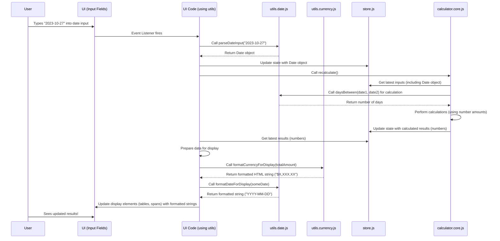

# Chapter 3: Date and Currency Utilities

Welcome back! In [Chapter 2: UI Display and DOM Interaction](02_ui_display_and_dom_interaction_.md), we learned how our calculator code finds and updates the parts of the web page you see. We saw how it grabs values from input boxes and puts calculated results into tables.

But what happens when you type in a date like "2023-10-27" or an amount like "$10,500.75"? The computer needs to understand these values correctly, and then display them back to you clearly and consistently, perhaps with commas, dollar signs, or in a specific date format. Using raw numbers and dates in programming can sometimes be tricky because of things like time zones or how to handle decimals and commas.

This is where utility functions come in handy. Think of them as a collection of specialized tools in a toolbox. Instead of writing the same complex code every time you need to handle a date or a currency value, you use a standard tool from your utility toolbox. This makes the code cleaner, easier to understand, and ensures that dates are always formatted the same way, and currency is always handled correctly.

In the `coi-calculator` project, we have dedicated files for these tools: `utils.date.js` for everything related to dates, and `utils.currency.js` for handling money values. These utilities are used *everywhere* in the application where dates or money are involved – from reading what you type into an input field to displaying the final calculated results.

Let's explore some of these essential tools.

### Handling Dates with `utils.date.js`

Dates are fundamental to calculating interest. We need to know when events happened (like the judgment date or a payment date) and figure out things like how many days are between them. The `utils.date.js` file provides functions for these common tasks.

Here are some key things these utilities help with:

*   **Parsing Dates:** Taking a string like "2023-10-27" from an input field and turning it into a JavaScript `Date` object that the code can work with.
*   **Formatting Dates:** Taking a JavaScript `Date` object and turning it back into a nice-looking string for display.
*   **Comparing Dates:** Easily checking if one date is before, after, or the same as another date.
*   **Calculating Differences:** Finding the number of days between two dates.

Let's look at a couple of simple but essential date utilities.

#### `parseDateInput(dateString)`: Turning Text into a Date

When you type "2023-10-27" into a date input box, the web page gives us that value as a text string. Our code needs to convert this string into a format that JavaScript understands as a date (`Date` object). The `parseDateInput` function does this job, specifically expecting the 'YYYY-MM-DD' format.

```javascript
// Inside utils.date.js (simplified)

/**
 * Parses a date string in YYYY-MM-DD format into a Date object.
 * @param {string} dateString - The date string (e.g., "2023-10-27").
 * @returns {Date|null} The parsed Date object, or null if invalid.
 */
export function parseDateInput(dateString) {
    if (!dateString) return null;
    const parts = dateString.split('-'); // Split "2023-10-27" into ["2023", "10", "27"]
    if (parts.length === 3) {
        const year = parseInt(parts[0], 10);
        const month = parseInt(parts[1], 10) - 1; // Month is 0-indexed (0=Jan, 11=Dec)
        const day = parseInt(parts[2], 10);
        // Create date in UTC to avoid timezone issues
        const date = new Date(Date.UTC(year, month, day));
        // Basic validation: Check if the created date matches the input parts
        if (!isNaN(date.getTime()) && date.getUTCFullYear() === year && date.getUTCMonth() === month && date.getUTCDate() === day) {
            return date; // Return the Date object
        }
    }
    // If format is wrong or parts are invalid, return null
    return null;
}

// How you might use it:
import { parseDateInput } from './utils.date.js';

const dateFromInput = "2023-10-27";
const dateObject = parseDateInput(dateFromInput);

console.log(dateObject); // Output: A Date object representing Oct 27, 2023 UTC
```

This function is essential for converting what the user types into a format the calculation engine can use. It also includes a basic check to make sure the string actually represents a valid date.

#### `formatDateForDisplay(date)`: Showing Dates Neatly

Once we have a `Date` object (either from parsing input or from a calculation), we need to show it back to the user, for example, in a summary table row. The `formatDateForDisplay` function takes a `Date` object and turns it back into a standard 'YYYY-MM-DD' string.

```javascript
// Inside utils.date.js (simplified)

/**
 * Formats a Date object into YYYY-MM-DD string (UTC).
 * @param {Date} date - The Date object.
 * @returns {string} The formatted date string, or '' if invalid.
 */
export function formatDateForDisplay(date) {
    if (!date || isNaN(date.getTime())) return '';
    const year = date.getUTCFullYear();
    const month = (date.getUTCMonth() + 1).toString().padStart(2, '0'); // Month is 0-indexed, add 1 & pad
    const day = date.getUTCDate().toString().padStart(2, '0'); // Pad day
    return `${year}-${month}-${day}`; // Combine into YYYY-MM-DD format
}

// How you might use it:
import { formatDateForDisplay } from './utils.date.js';
// Assume dateObject is a valid Date object

const dateStringForDisplay = formatDateForDisplay(dateObject);

console.log(dateStringForDisplay); // Output: "2023-10-27"
```

This function ensures that all dates displayed in the UI have a consistent look, making it easy for the user to read and understand.

#### `daysBetween(date1, date2)`: Finding the Number of Days

A core part of interest calculation is knowing the exact number of days between two dates. This function takes two `Date` objects and calculates this difference. A key detail for this specific calculator is that it counts the *start* date but *excludes* the *end* date in the count.

```javascript
// Inside utils.date.js (simplified calculation logic)

/**
 * Calculates the number of days between two UTC dates,
 * including the first date and excluding the last date.
 * @param {Date} date1 - The start date (UTC).
 * @param {Date} date2 - The end date (UTC).
 * @returns {number} The number of days between, or 0 if invalid/same day.
 */
export function daysBetween(date1, date2) {
    if (!date1 || !date2 || isNaN(date1.getTime()) || isNaN(date2.getTime())) {
        return 0;
    }

    // Normalize dates to midnight UTC to compare just the days
    const normalizedDate1 = normalizeDate(date1); // normalizeDate is another util function
    const normalizedDate2 = normalizeDate(date2);

    // If the end date is before or the same as the start date, 0 days
    if (normalizedDate2.getTime() <= normalizedDate1.getTime()) {
        return 0;
    }

    // Calculate difference in milliseconds
    const differenceInMilliseconds = normalizedDate2.getTime() - normalizedDate1.getTime();

    // Convert milliseconds to days, rounding down, then add 1 to include the start day
    return Math.floor(differenceInMilliseconds / (1000 * 60 * 60 * 24)) + 1;
}

// How you might use it:
import { daysBetween, parseDateInput } from './utils.date.js';

const startDate = parseDateInput("2023-10-27");
const endDate = parseDateInput("2023-10-30"); // 3 days later

const numberOfDays = daysBetween(startDate, endDate);

console.log(numberOfDays); // Output: 4 (Oct 27, 28, 29, 30 - includes start, excludes end based on interval logic)
```

This function is used heavily by the [Calculation Engine](07_calculation_engine_.md) to determine the length of different interest periods.

There are other date utilities for comparing dates (`dateEqual`, `dateBefore`, etc.) and manipulating them (`subtractOneDay`), all serving to provide a reliable way to handle date logic throughout the project.

### Handling Currency with `utils.currency.js`

Just like dates, numbers representing money require special care. They need to be displayed with the correct currency symbol, commas for thousands, and usually exactly two decimal places. When reading input, we need to be able to handle inputs that might include these characters.

The `utils.currency.js` file provides functions to parse and format currency values.

Here are some key things these utilities help with:

*   **Parsing Currency:** Taking a string like "$10,500.75" from an input field and turning it into a simple number (`10500.75`) that the code can use for calculations.
*   **Formatting for Input:** Taking a number and formatting it nicely for display *within* an input field (often without the dollar sign, but with commas).
*   **Formatting for Display:** Taking a number and formatting it for display elsewhere on the page (like in tables), including the currency symbol and special styling for negative amounts.

Let's look at some core currency utilities.

#### `parseCurrency(value)`: Turning Money Text into a Number

When a user enters "10,500.75" or "$10,500.75" into an amount field, we need to convert this into a plain number (`10500.75`) before we can perform any calculations. This function removes currency symbols, commas, and then converts the string to a floating-point number.

```javascript
// Inside utils.currency.js (simplified)

/**
 * Parses a currency string (potentially with $, commas) into a number.
 * @param {string|number} value - The currency string or number.
 * @returns {number} The parsed number, or 0 if invalid.
 */
export function parseCurrency(value) {
    if (typeof value !== 'string') {
        value = String(value); // Ensure it's a string
    }
    // Remove dollar signs and commas, then parse as float
    const number = parseFloat(value.replace(/[$,]/g, ''));
    // Return the number, or 0 if the parsing failed
    return isNaN(number) ? 0 : number;
}

// How you might use it:
import { parseCurrency } from './utils.currency.js';

const amountFromInput1 = "10,500.75";
const amount1 = parseCurrency(amountFromInput1);
console.log(amount1); // Output: 10500.75

const amountFromInput2 = "$500.00";
const amount2 = parseCurrency(amountFromInput2);
console.log(amount2); // Output: 500
```

This is crucial for ensuring that mathematical operations in the [Calculation Engine](07_calculation_engine_.md) work correctly with the numerical values.

#### `formatCurrencyForInputWithCommas(value)`: Formatting for Input Fields

Input fields often look better when numbers have commas for readability, but usually don't include the currency symbol while you're typing. This function formats a number specifically for display *within* an input element.

```javascript
// Inside utils.currency.js (simplified)

/**
 * Formats a number into a currency string with commas for input fields (e.g., "1,234.56").
 * Suitable for display within an input field when not focused.
 * @param {number} value - The number to format.
 * @returns {string} The formatted currency string with commas, no symbol.
 */
export function formatCurrencyForInputWithCommas(value) {
    if (isNaN(value) || value === null) return "0.00";
    // Use built-in Intl.NumberFormat for locale-aware formatting (like commas)
    const formatter = new Intl.NumberFormat('en-CA', {
        minimumFractionDigits: 2,
         maximumFractionDigits: 2,
     });
     // Format the number and return the string
     return formatter.format(value);
 }

// How you might use it:
import { formatCurrencyForInputWithCommas } from './utils.currency.js';

const calculatedAmount = 12345.67;
const formattedForInput = formatCurrencyForInputWithCommas(calculatedAmount);

console.log(formattedForInput); // Output: "12,345.67"
```

Note that the actual input *element* might show a dollar sign visually, but this function provides the numerical part with commas for the display value. (The `formatCurrencyForInput` function exists for a format that includes the '$', like "$1234.56", often used when the input *doesn't* have auto-formatting).

#### `formatCurrencyForDisplay(value)`: Formatting for Display (e.g., Tables)

When showing results in a table or a summary total, we want a full currency format, including the dollar sign, commas, and specific styling (like red color) for negative numbers. This function handles all of that, returning an HTML string that includes a `<span>` with the correct class for styling.

```javascript
// Inside utils.currency.js (simplified)

/**
 * Formats a number into a currency string for display, including styling for negatives.
 * @param {number} value - The number to format.
 * @returns {string} HTML string with formatted currency and appropriate class.
 */
export function formatCurrencyForDisplay(value) {
    if (isNaN(value) || value === null) {
        return `<span class="currency">$0.00</span>`; // Consistent zero display
    }

    const absValue = Math.abs(value);
    // Determine CSS class based on value being negative
    const className = value < 0 ? "currency negative" : "currency";

    // Use Intl.NumberFormat for full currency format (e.g., $1,234.56)
    const currencyFormatter = new Intl.NumberFormat('en-CA', {
        style: 'currency',
        currency: 'CAD', // Use Canadian Dollar
        minimumFractionDigits: 2,
        maximumFractionDigits: 2,
    });

    // Format the absolute value
    const formattedNumber = currencyFormatter.format(absValue);

    // Add negative sign manually if Intl doesn't (it often uses parentheses)
    const sign = value < 0 ? '-' : '';

    // Return HTML span with class and formatted number
    return `<span class="${className}">${sign}${formattedNumber}</span>`;
}

// How you might use it:
import { formatCurrencyForDisplay } from './utils.currency.js';

const positiveResult = 1500.50;
const negativeResult = -25.78;

console.log(formatCurrencyForDisplay(positiveResult)); // Output: <span class="currency">$1,500.50</span>
console.log(formatCurrencyForDisplay(negativeResult)); // Output: <span class="currency negative">-$25.78</span>
```

This function ensures that all displayed currency values are formatted consistently and are easy for the user to read, immediately highlighting negative amounts.

### How Utilities Fit into the Application Flow

These utility functions are not standalone; they are essential helpers used by other parts of the application, particularly the UI display code ([UI Display and DOM Interaction](02_ui_display_and_dom_interaction_.md)) and the [Calculation Engine](07_calculation_engine_.md)).

Here's a simplified look at how they are used in the cycle we saw in the previous chapter:



As you can see, the UI code acts as the bridge. It uses the `parse...` utilities to convert user input into data formats the rest of the application understands (like `Date` objects and simple numbers). After the [Calculation Engine](07_calculation_engine_.md) has done its work and updated the central data storage ([State Management (Zustand Store)](04_state_management__zustand_store__.md)), the UI code uses the `format...` utilities to convert the internal data formats back into user-friendly strings for display on the page.

Using these utilities ensures consistency: every date looks the same, every currency value is formatted correctly, and the logic for parsing and calculations is centralized and reliable.

### Conclusion

In this chapter, we explored the crucial role of utility functions, specifically those for handling dates (`utils.date.js`) and currency (`utils.currency.js`). We saw how they act as a shared toolbox, providing standard ways to parse input strings into usable data formats and format internal data back into user-friendly strings for display. These utilities are essential for ensuring the calculator handles dates and money accurately and displays them consistently, greatly improving the user experience.

These formatted dates and currency values, as well as the results of calculations using them, need to be stored somewhere central and accessible by different parts of the application. In the next chapter, we'll dive into [State Management (Zustand Store)](04_state_management__zustand_store__.md), learning how the application keeps track of all the input values and calculated results.

[State Management (Zustand Store)](04_state_management__zustand_store__.md)

---

<sub><sup>Generated by [AI Codebase Knowledge Builder](https://github.com/The-Pocket/Tutorial-Codebase-Knowledge).</sup></sub> <sub><sup>**References**: [[1]](https://github.com/Mharbulous/coi-calculator/blob/6fa85820c594929557e5b2e60eeb12bcd27dfcef/BC COIA calculator/utils.currency.js), [[2]](https://github.com/Mharbulous/coi-calculator/blob/6fa85820c594929557e5b2e60eeb12bcd27dfcef/BC COIA calculator/utils.date.js)</sup></sub>
