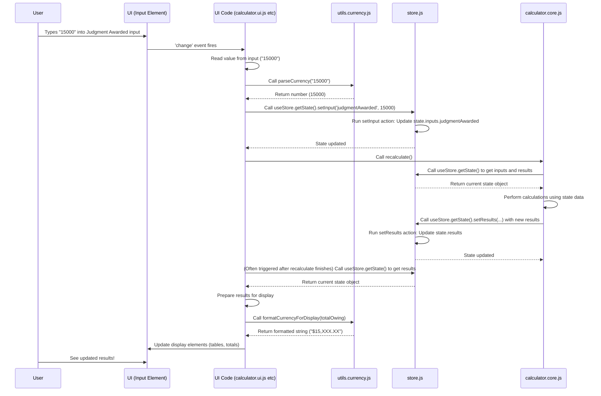

# Chapter 4: State Management (Zustand Store)

Welcome back! In [Chapter 3: Date and Currency Utilities](03_date_and_currency_utilities_.md), we learned about the helpful tools our calculator uses to correctly understand dates you type in ("parse") and display numbers nicely formatted as currency ("format"). These utilities are great at handling individual pieces of data, but where does all this data *live*? Where are all the numbers you entered, the dates, the checkbox states, and the final calculated results stored so that *every* part of the application can access the *same* information?

Imagine the calculator application as a complex machine. It has input dials (the fields you type into), display screens (the tables and totals), and a powerful engine (the calculation code). All these parts need to work together, and they all need access to the same crucial information at any given moment: the *current state* of the calculation.

If each part kept its own copy of the data, things would quickly get confusing. The input fields would know what you typed, but the calculation engine might not, or the display might show old results. We need a single, reliable source of truth.

### The Central Brain: The State Store

This is where "State Management" comes in. In the `coi-calculator` project, we use a library called **Zustand** to create a central **store**. Think of this store as the application's central brain or a shared notebook that everyone looks at and updates.

This store holds *all* the important data:

*   **Your Inputs:** The dates you selected, the amounts you entered, which checkboxes are checked.
*   **The Results:** The calculated interest amounts, the totals, the per diem value.
*   **Application Settings:** Like the selected jurisdiction.

When you interact with the calculator (type a number, change a date), the code doesn't just change something on the screen; it updates the relevant information in this central store. When the calculations finish, the results are *also* saved in the store. Then, the parts of the UI that need to show this data look at the store and update themselves accordingly.

### Why Use a Store Like Zustand?

1.  **Single Source of Truth:** All parts of the app get information from one place, preventing inconsistencies.
2.  **Predictable Updates:** Data is only changed through specific "actions," making it easier to understand *how* and *when* the state changes.
3.  **Easier Debugging:** If something is wrong, you can look at the state in the store to see if the data itself is incorrect.
4.  **Decoupling:** UI components don't need to know *where* the data came from (input field, calculation engine, etc.); they just need to know how to read it from the store and display it.

### The Core Concepts

Zustand is designed to be simple. Here are the main ideas:

*   **The Store Instance:** This is the actual object that holds the state and provides ways to interact with it. In `store.js`, we create one instance using `createStore`.
*   **The State:** This is a plain JavaScript object inside the store. It's organized into categories like `inputs` and `results`.
*   **Actions:** These are functions defined within the store that are the *only* way to change the state. You don't directly modify the state object from outside the store. You call an action function (like `setInput` or `setResults`) to request a change.
*   **`set` function:** Inside an action, you use a special `set` function (provided by Zustand) to update the state safely. You pass it a function that receives the current state and returns the new state.

### The Store in `coi-calculator`: `store.js`

All the state management logic for the calculator lives in the `store.js` file. Let's look at its structure.

```javascript
// Inside store.js (simplified)
import { createStore } from 'zustand/vanilla';
// ... other imports like normalizeDate ...

const store = createStore((set) => ({
    // The STATE object
    inputs: {
        // All the input fields and checkboxes live here
        prejudgmentStartDate: null,
        dateOfJudgment: null,
        judgmentAwarded: 0,
        jurisdiction: 'BC',
        showPrejudgment: true,
        // ... more input properties ...
    },
    results: {
        // All the calculation outputs live here
        specialDamages: [],
        prejudgmentResult: { total: 0, details: [] },
        postjudgmentResult: { total: 0 },
        totalOwing: 0,
        perDiem: 0,
        // ... more result properties ...
    },
    savedPrejudgmentState: {
        // Used to temporarily save prejudgment data
        // ...
    },

    // The ACTIONS (functions that update state)
    setInputs: (newInputs) => set((state) => ({
        inputs: { ...state.inputs, ...newInputs }
    })),

    setInput: (key, value) => set((state) => ({
        inputs: { ...state.inputs, [key]: value }
    })),

    setResults: (newResults) => set((state) => ({
        results: { ...state.results, ...newResults }
    })),

    // ... more actions for specific parts of the state ...

    resetStore: (useDefaults = false) => {
        // Logic to reset state, optionally with defaults
        // ...
    },

    initializeStore: (defaultValues) => set((state) => ({
        // Logic to set initial values on app startup
        // ...
    }))
}));

// Export a simple object to interact with the store
const useStore = {
  getState: store.getState,
  setState: store.setState, // Less common to use setState directly outside actions
  // ... other methods if needed ...
};

export default useStore;
```

This code sets up the store. Notice how:
*   `createStore` takes a function. This function receives `set` and should return the initial state object along with the actions.
*   The initial state has clear sections for `inputs`, `results`, etc.
*   Actions are functions like `setInput`. Inside these actions, `set((state) => ({ ... }))` is used to update the state. The arrow function `(state) => ({ ... })` receives the *current* state and returns the *part* of the state that should be updated. Using the spread operator (`...state.inputs`) is important to keep the existing values and only overwrite the ones you intend to change.
*   Finally, the file exports a simple object `useStore` which gives other modules access to the store's functions, most importantly `getState()`.

### How Data Flows Through the Store

Let's revisit the cycle we saw in [Chapter 2: UI Display and DOM Interaction](02_ui_display_and_dom_interaction_.md) and see how the store fits in.

Imagine the user changes the "Judgment Awarded" amount:



This diagram shows the crucial role of the Store:
1.  User input is parsed and sent *into* the Store using an action (`setInput`).
2.  The [Calculation Engine](07_calculation_engine_.md) *reads* from the Store (`getState()`) to get the current inputs and performs calculations.
3.  The Engine saves its *results* back *into* the Store using another action (`setResults`).
4.  The UI code *reads* the updated results *from* the Store (`getState()`) and formats them for display using the [Date and Currency Utilities](03_date_and_currency_utilities_.md), finally updating the DOM.

The store is the central hub for data exchange between the UI and the calculation logic.

### Examining Key Parts of the State

Let's look at the structure of the state object defined in `store.js`.

| State Section         | What it Stores                                                                  | Examples                                           |
| :-------------------- | :------------------------------------------------------------------------------ | :------------------------------------------------- |
| `inputs`              | Values entered by the user or set as defaults                                   | `dateOfJudgment`, `judgmentAwarded`, `showPrejudgment` |
| `results`             | The outcome of the calculations                                                 | `totalOwing`, `perDiem`, `prejudgmentResult.total` |
| `savedPrejudgmentState` | A temporary copy of prejudgment data, used when toggling the section visibility | Saved `specialDamages` array, saved `prejudgmentResult` |

This clear separation helps keep the data organized. Inputs are what the user provides; results are what the calculator computes.

### Important Actions in the Store

The `store.js` file defines several actions to update these parts of the state. Here are a few key ones:

*   `setInput(key, value)`: The most common action for updating a single field in the `inputs` section (e.g., `setInput('judgmentAwarded', 15000)`).
*   `setInputs(newInputs)`: Updates multiple fields in the `inputs` section at once (e.g., used during initialization).
*   `setResult(key, value)`: Updates a single field in the `results` section.
*   `setResults(newResults)`: Updates multiple fields in the `results` section at once (commonly used by the [Calculation Engine](07_calculation_engine_.md)).
*   `setSpecialDamages(specialDamagesArray)`: Updates the entire list of special damages in the `results` section and automatically recalculates `results.specialDamagesTotal`.
*   `addSpecialDamage(damageObject)`: Adds a new item to the `specialDamages` array and updates the total.
*   `updateSpecialDamage(index, damageObject)`: Modifies an existing item in the `specialDamages` array and updates the total.
*   `removeSpecialDamage(index)`: Removes an item from the `specialDamages` array and updates the total.
*   `savePrejudgmentState()`: Copies the current prejudgment inputs and results into `savedPrejudgmentState`.
*   `restorePrejudgmentState()`: Copies data from `savedPrejudgmentState` back into `inputs` and `results`.
*   `resetStore(useDefaults)`: Clears most data in the store, optionally setting initial default values for inputs and results.

Each of these actions follows the pattern of using the `set` function to safely update the state based on its previous value.

### Getting Data Out of the Store

While actions are used to *put* data *into* the store, other parts of the application need to *get* data *out* to read the current state. This is done using `useStore.getState()`.

```javascript
// Example: Getting inputs and results to perform calculation
import useStore from './store.js';
// ... other imports ...

function recalculate() {
    // Get the current state from the store
    const state = useStore.getState();
    const currentInputs = state.inputs;
    const currentResults = state.results; // You might use previous results or reset

    console.log("Current Judgment Awarded:", currentInputs.judgmentAwarded);
    console.log("Current Prejudgment Visibility:", currentInputs.showPrejudgment);

    // ... perform calculations using currentInputs ...

    // ... generate new results ...

    // Update the store with the new results
    useStore.getState().setResults({
        totalOwing: calculatedTotal,
        perDiem: calculatedPerDiem,
        // ... other results ...
    });
}
```

As seen in the `recalculate` example, the function simply calls `useStore.getState()` to get the snapshot of the current state and then accesses the properties it needs (`state.inputs`, `state.results`). After calculations, it uses an action (`setResults`) to put the new data back into the store.

### Initialization with the Store

Remember from [Chapter 1: Application Initialization and Flow](01_application_initialization_and_flow_.md) and [Chapter 2: UI Display and DOM Interaction](02_ui_display_and_dom_interaction_.md) that the calculator starts with default values. The store plays a key role here too.

During the initialization process (`initializeCalculator` in `calculator.ui.js`), after setting default values in the *UI* fields, these defaults are also used to initialize the *store*:

```javascript
// Inside calculator.ui.js (simplified init)
import useStore from './store.js';
// ... other imports ...

function initializeCalculator() {
    // ... set default values in DOM inputs ...
    // ... setup event listeners ...

    // Initialize the store with default inputs and empty results
    const defaultInputs = {
        // Get default values from DOM utilities or define here
        judgmentAwarded: parseFloat(elements.judgmentAwardedInput.value || '0'),
        dateOfJudgment: parseDateInput(elements.judgmentDateInput.value || ''),
        // ... etc ...
        showPrejudgment: elements.showPrejudgmentCheckbox.checked,
        showPostjudgment: elements.showPostjudgmentCheckbox.checked,
        showPerDiem: elements.showPerDiemCheckbox.checked
    };

    const defaultResults = { /* ... initial empty structure ... */ };

    // Use the store's action to set the initial state
    useStore.getState().initializeStore({
        inputs: defaultInputs,
        results: defaultResults
    });

    // Now that the store is initialized, perform the first calculation
    recalculate();
    // ...
}
```

This ensures that the store starts with the same default values that the user initially sees, providing a consistent starting point for the application and the first calculation.

### Conclusion

In this chapter, we've explored the concept of state management and how the `coi-calculator` project uses the Zustand library to handle it. We learned that the Zustand store acts as the application's central brain, holding all the important data like inputs and results. We saw how data flows into the store via "actions" and how other parts of the application read data from the store using `getState()`. This pattern provides a single source of truth, making the application's data flow predictable and easier to manage.

With a solid understanding of where the application's data lives, we're ready to look at how external services are integrated. In the next chapter, we'll examine [Payment Integration (Stripe)](05_payment_integration__stripe__.md), understanding how the calculator handles connecting with a payment provider.

[Payment Integration (Stripe)](05_payment_integration__stripe__.md)

---

<sub><sup>Generated by [AI Codebase Knowledge Builder](https://github.com/The-Pocket/Tutorial-Codebase-Knowledge).</sup></sub> <sub><sup>**References**: [[1]](https://github.com/Mharbulous/coi-calculator/blob/6fa85820c594929557e5b2e60eeb12bcd27dfcef/BC COIA calculator/store.js)</sup></sub>
