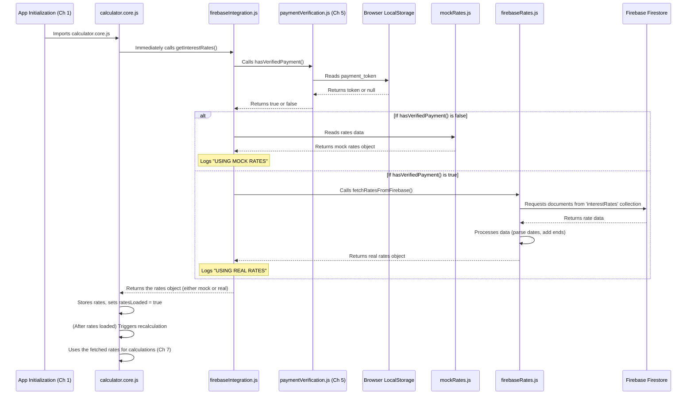

# Chapter 6: Interest Rate Data Management

Welcome back! In [Chapter 5: Payment Integration (Stripe)](05_payment_integration__stripe__.md), we explored how the `coi-calculator` handles payments using Stripe, and importantly, how it determines if a user has paid for access to premium features by checking for a payment token stored in their browser's `localStorage`.

Why was that payment status important? Because the accuracy of an interest calculation depends heavily on using the correct historical interest rates, and accessing the most precise, official rates sometimes requires a payment.

Think of the calculator needing historical data like a historian needing records. To write an accurate account of the past, the historian needs access to official documents and archives. In our application, these "official documents" are the historical interest rates, which change over time based on economic factors and government regulations.

This is where **Interest Rate Data Management** comes in. This part of the application is responsible for getting the correct set of interest rates the calculator needs to perform its calculations. It acts like the application's "research department," knowing exactly where to get the data and making sure it's ready for use.

### The Challenge: Two Sources of Truth

The core challenge is that the interest rate data can come from two places:

1.  **Built-in Mock Rates:** For free users or in demo mode, the calculator uses a set of approximate rates built directly into the application code. These are useful for demonstration and basic testing but are *not* suitable for official court calculations.
2.  **Official Firebase Rates:** For users with a verified payment, the calculator fetches the official, accurate historical rates from an online database (Firebase Firestore). This data is precise and regularly updated.

The "Interest Rate Data Management" abstraction needs to decide which source to use and then provide that data to the rest of the application, primarily the [Calculation Engine](07_calculation_engine_.md).

### The Decider: `firebaseIntegration.js`

At the heart of the interest rate data management is the `firebaseIntegration.js` module. Despite its name, which suggests it's *only* about Firebase, this module is actually the **central point for getting interest rates**, regardless of the source.

Its main job is to provide a single function that other parts of the app can call to get the rates they need. This function checks the user's payment status and then either loads the mock rates or attempts to fetch the real rates from Firebase.

Let's look at the main function in `firebaseIntegration.js`:

```javascript
// Inside firebaseIntegration.js (Simplified)

// Import the function to check payment status from Chapter 5
import { hasVerifiedPayment } from './paymentVerification.js';
// Import the function to fetch rates from the real Firebase source
import { fetchRatesFromFirebase } from './firebaseRates.js';
// Import the built-in mock rates
import mockRates, { lastUpdated as mockLastUpdated, validUntil as mockValidUntil } from './mockRates.js';

// This is the main function called by the application
export async function getInterestRates() {
  // 1. Check if the user has verified payment (from Chapter 5)
  const isPaid = hasVerifiedPayment();

  // 2. Log which source is being used for clarity
  if (isPaid) {
    console.log('%c✅ USING REAL INTEREST RATES: Payment verified', 'color: green; font-weight: bold');
  } else {
    console.log('%c⚠️ USING MOCK INTEREST RATES: Demo mode active', 'color: orange; font-weight: bold');
  }

  // 3. If NOT paid, immediately return the mock rates
  if (!isPaid) {
    return {
      rates: mockRates,
      lastUpdated: mockLastUpdated,
      validUntil: mockValidUntil,
      source: 'mock' // Indicate the source
    };
  }

  // 4. If PAID, try to fetch rates from the real Firebase source
  try {
    const result = await fetchRatesFromFirebase();
    // If fetchRatesFromFirebase was successful, it returns source: 'firebase'
    return result;
  } catch (error) {
    // 5. If fetching from Firebase fails for a paid user, log the error...
    console.error('Error fetching interest rates from Firebase:', error);
    // ...and re-throw the error. We do NOT fallback to mock rates here.
    // Failure to get real rates for a paid user is a critical error.
    throw error;
  }
}
```

This `getInterestRates` function is the gatekeeper. It first calls `hasVerifiedPayment()` from our [Payment Integration (Stripe)](05_payment_integration__stripe__.md) logic. Based on the result, it decides the data source:

*   If `hasVerifiedPayment()` is `false`, it simply returns the rates loaded from the local `mockRates.js` file.
*   If `hasVerifiedPayment()` is `true`, it calls the `fetchRatesFromFirebase()` function (from the `firebaseRates.js` file) to retrieve the rates from the online database. If that fetch fails, it logs the error and throws it, indicating a problem with getting the required paid data.

This function ensures that any part of the application needing rates only has to call `getInterestRates()`, and it will automatically receive the correct data based on the payment status.

### The Backup: `mockRates.js`

The `mockRates.js` file is straightforward. It contains a JavaScript object holding the approximate interest rates. This is the "free sample" data.

```javascript
// Inside mockRates.js (Simplified Structure)

// Helper date functions are also here
function parseUTCDate(dateString) { /* ... */ }
function endOfDayUTC(date) { /* ... */ }

// When the mock rates were last updated
const lastUpdated = parseUTCDate("2025-04-19");

// Until when the mock rates are valid
const validUntil = parseUTCDate("2025-06-30");

// The actual rate data object
const rates = {
    BC: [
        { start: "1993-01-01", prejudgment: 5.60, postjudgment: 7.65 },
        { start: "1993-07-01", prejudgment: 4.30, postjudgment: 6.35 },
        // ... many more rate periods ...
        { start: "2025-01-01", prejudgment: 3.80, postjudgment: 5.90 },
    ],
    AB: [ /* ... Alberta mock rates ... */ ],
    ON: [ /* ... Ontario mock rates ... */ ],
};

// The rates are processed slightly to add 'end' dates for each period
// This processing uses the date helper functions
const processedRates = {};
// ... processing logic ...

// Export the processed rates and dates
export { processedRates as default, lastUpdated, validUntil };
```

This file defines the raw rate data as simple objects with `start`, `prejudgment`, and `postjudgment` values. It also includes helper functions to parse the date strings into JavaScript `Date` objects and adds an `end` date to each rate period based on the start date of the *next* period or the overall `validUntil` date. This structure (with `start` and `end` dates) is convenient for the [Calculation Engine](07_calculation_engine_.md).

### The Source of Truth: Firebase

If `hasVerifiedPayment()` returns `true`, the application needs to get the real rates from Firebase. This involves two files:

1.  **`firebaseConfig.js`**: This file holds the necessary details (like API keys) to connect to your specific Firebase project. It initializes the Firebase app and the Firestore database instance.

    ```javascript
    // Inside firebaseConfig.js (Simplified)

    import { initializeApp } from "firebase/app";
    import { getFirestore } from "firebase/firestore";

    // Firebase configuration object (sensitive keys replaced with dummy)
    const firebaseConfig = {
      apiKey: "YOUR_API_KEY",
      authDomain: "YOUR_AUTH_DOMAIN",
      projectId: "YOUR_PROJECT_ID",
      // ... other config ...
    };

    // Initialize Firebase app
    export const firebaseApp = initializeApp(firebaseConfig);

    // Initialize Firestore database instance
    export const db = getFirestore(firebaseApp);
    ```

    This module simply sets up the connection. The `db` object is what other modules use to interact with the database.

2.  **`firebaseRates.js`**: This file contains the logic to talk to the Firebase database instance provided by `firebaseConfig.js`. Its main function is `fetchRatesFromFirebase`.

    ```javascript
    // Inside firebaseRates.js (Simplified)

    import { collection, getDocs } from "firebase/firestore";
    import { db } from "./firebaseConfig.js"; // Import the database instance

    // Helper date functions (similar to mockRates.js)
    function parseUTCDate(dateString) { /* ... */ }
    function endOfDayUTC(date) { /* ... */ }

    // Function to fetch rates from Firebase Firestore
    export async function fetchRatesFromFirebase() {
        try {
            // Reference the 'interestRates' collection
            const ratesCollection = collection(db, "interestRates");

            // Get all documents in the collection (one per jurisdiction like 'BC-COIA')
            const querySnapshot = await getDocs(ratesCollection);

            // ... logic to process querySnapshot data ...
            // This includes parsing dates and adding end dates,
            // similar to how mockRates.js processes its data.
            // It structures the data like: { BC: [...rates], AB: [...rates] }

            const processedFetchedRates = {};
            let fetchedLastUpdated = null;
            let fetchedValidUntil = null;

            // Loop through documents (jurisdictions)
            querySnapshot.forEach((docSnapshot) => {
                 const data = docSnapshot.data();
                 const jurisdictionCode = docSnapshot.id.split('-')[0]; // e.g. "BC"
                 if (data.rates && Array.isArray(data.rates)) {
                     // Process and store rates for this jurisdiction
                     processedFetchedRates[jurisdictionCode] = data.rates
                         .map(rate => ({ ...rate, start: parseUTCDate(rate.start) })) // Parse start dates
                         .filter(rate => rate.start !== null)
                         .sort((a, b) => a.start - b.start) // Sort by start date
                         .map((rate, index, arr) => { // Calculate end dates
                             const nextStartDate = index < arr.length - 1 ? new Date(arr[index + 1].start) : null;
                             const endDate = nextStartDate ? new Date(nextStartDate.setUTCDate(nextStartDate.getUTCDate() - 1)) : parseUTCDate(data.validUntil);
                             return { ...rate, end: endOfDayUTC(endDate) };
                         });
                 }
                 if (data.lastUpdated) fetchedLastUpdated = parseUTCDate(data.lastUpdated);
                 if (data.validUntil) fetchedValidUntil = parseUTCDate(data.validUntil);
            });

            // If data was found, return it
            if (Object.keys(processedFetchedRates).length > 0) {
                 return {
                     rates: processedFetchedRates,
                     lastUpdated: fetchedLastUpdated,
                     validUntil: fetchedValidUntil,
                     source: 'firebase' // Indicate the source
                 };
            } else {
                 // If no data came back, something is wrong
                 throw new Error("No interest rate data retrieved from Firebase");
            }

        } catch (error) {
            console.error("Error fetching rates from Firebase:", error);
            throw error; // Propagate the error up
        }
    }
    ```

    The `fetchRatesFromFirebase` function connects to the `interestRates` collection in Firestore, retrieves the documents (one for each jurisdiction like "BC-COIA"), and then processes the data. The processing step is crucial: it parses the date strings from Firebase into JavaScript `Date` objects and calculates the `end` date for each rate period based on the next period's start date or the overall `validUntil` date from the database. This makes the data format consistent whether it comes from mock rates or Firebase, which is important for the [Calculation Engine](07_calculation_engine_.md).

### The Data Structure

Whether the data comes from `mockRates.js` or `firebaseRates.js`, the goal is to provide an object with a consistent structure:

```javascript
{
    rates: { // An object where keys are jurisdiction codes (BC, AB, ON)
        BC: [ // An array of rate period objects for BC
            {
                start: Date object, // Start date of this period (UTC)
                end: Date object,   // End date of this period (UTC)
                prejudgment: Number, // Annual prejudgment rate (%)
                postjudgment: Number // Annual postjudgment rate (%)
            },
            { /* ... next period ... */ }
            // ...
        ],
        AB: [ /* ... rates for Alberta ... */ ],
        ON: [ /* ... rates for Ontario ... */ ],
        // ... other jurisdictions ...
    },
    lastUpdated: Date object, // Date when the rates were last updated
    validUntil: Date object,  // Date until the current rates are valid
    source: 'mock' | 'firebase' // String indicating where the data came from
}
```

This standardized structure is what the [Calculation Engine](07_calculation_engine_.md) expects, regardless of whether it's using free or paid data.

### The Flow Visualized

Here's how the Interest Rate Data Management fits into the overall application flow when rates are needed:



This diagram shows that the `firebaseIntegration.js` module is the key player. It orchestrates the process, checking the payment status and directing the request to either the local mock data or the remote Firebase data source. Once the data is retrieved and processed into the standard format, it's returned to `calculator.core.js` for use in calculations.

### Handling Errors

As seen in the `getInterestRates` code snippet, if `hasVerifiedPayment()` is true but the attempt to fetch rates from Firebase fails (e.g., network error, incorrect config), the `fetchRatesFromFirebase` function throws an error. `getInterestRates` catches this, logs it, and re-throws it.

This error then propagates up the call stack. As shown in the [Chapter 1: Application Initialization and Flow](01_application_initialization_and_flow_.md) flowchart and mentioned in the Firebase README, the initial call to `loadRatesFromFirebase` within `calculator.core.js` has error handling (`.catch()`) specifically for this. This handling typically displays a user-friendly alert message, informing the user that rates couldn't be loaded and they might need to check their connection. This prevents the application from attempting calculations with missing data in the paid mode.

### Conclusion

In this chapter, we've explored how the `coi-calculator` project manages its crucial interest rate data. We learned that the `firebaseIntegration.js` module acts as the central point for retrieving rates, intelligently deciding whether to serve approximate built-in mock rates or precise rates fetched from the online Firebase database, based on the user's payment status determined in [Payment Integration (Stripe)](05_payment_integration__stripe__.md). We looked at the structure of the mock rates (`mockRates.js`) and the process of fetching and processing data from Firebase (`firebaseConfig.js`, `firebaseRates.js`), ensuring the data is in a consistent format.

With the correct interest rates now loaded and available, the application has all the necessary ingredients to perform the actual calculations. In the next chapter, we will delve into the heart of the application: the [Calculation Engine](07_calculation_engine_.md), which takes all the inputs and rate data and computes the final interest amounts.

[Calculation Engine](07_calculation_engine_.md)