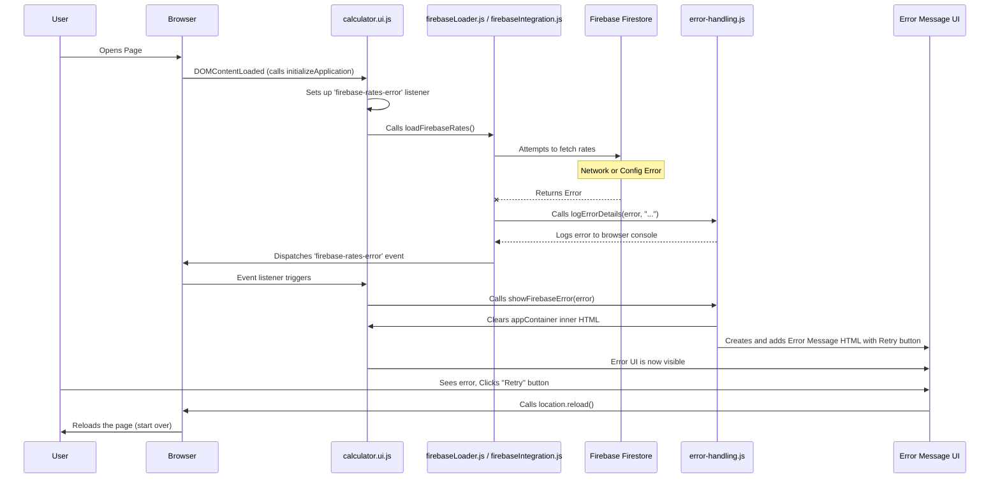

# Chapter 8: Error Handling

Welcome back for the final chapter! We've journeyed through the `coi-calculator` project, understanding how it wakes up ([Chapter 1: Application Initialization and Flow](01_application_initialization_and_flow_.md)), interacts with the screen ([Chapter 2: UI Display and DOM Interaction](02_ui_display_and_dom_interaction_.md)), handles dates and money ([Chapter 3: Date and Currency Utilities](03_date_and_currency_utilities_.md)), manages its data ([Chapter 4: State Management (Zustand Store)](04_state_management__zustand_store__.md)), integrates payment services ([Chapter 5: Payment Integration (Stripe)](05_payment_integration__stripe__.md)), loads interest rates ([Chapter 6: Interest Rate Data Management](06_interest_rate_data_management_.md)), and performs the core calculations ([Chapter 7: Calculation Engine](07_calculation_engine_.md)).

But what happens when things don't go as planned? What if the application can't connect to the internet to fetch interest rates? What if there's a problem loading an important part of the code? Without proper handling, the application might just freeze, display confusing errors, or even crash entirely. This is a terrible user experience.

Think of **Error Handling** as the application's built-in **ambulance service and doctor**. When something goes wrong (the application gets "sick" or "injured"), this system steps in. Its job is to:

1.  **Detect the Problem:** Identify that an error has occurred.
2.  **Stabilize the Patient:** Prevent the application from crashing or getting into a worse state.
3.  **Inform the Patient:** Show a clear, user-friendly message explaining what happened, in language the user can understand.
4.  **Gather Medical Records:** Log technical details about the error for developers to diagnose and fix the problem later.
5.  **Suggest Recovery:** Offer the user a way to try again, like a "Retry" button.

The main use case for error handling in this project is dealing with potential failures when trying to fetch interest rate data, especially from Firebase (as discussed in [Chapter 6: Interest Rate Data Management](06_interest_rate_data_management_.md)). If these rates can't be loaded, the calculator simply cannot perform its core function accurately, particularly for paid users needing official rates.

### The Error Handling Flow: From Problem to Recovery

Let's trace the journey of an error, focusing on the common scenario of failing to load Firebase rates:

1.  **The Problem Occurs:** Code attempting to fetch data from Firebase (in `firebaseIntegration.js` called by `firebaseLoader.js`) encounters a network issue or a configuration problem.
2.  **Detection and Logging:** The code catches the error. It logs the technical details to the browser's developer console using a special logging function (`logErrorDetails`).
3.  **Signaling the Main App:** Instead of just stopping or crashing, the code dispatches a custom event (like `'firebase-rates-error'`) that acts like an alarm signal. This tells the rest of the application, "Hey, something went wrong with the rates!"
4.  **Main App Reacts:** The main application initialization code (in `calculator.ui.js`) is "listening" for this specific alarm signal. When it hears it, it knows it can't proceed with normal initialization and calculation.
5.  **Displaying the Error UI:** The main app calls a function (`showFirebaseError`) that clears the normal calculator display and shows a special error message on the page for the user.
6.  **User Sees Error:** The user sees a clear message explaining that rates couldn't be loaded and what they might try (check internet, retry).
7.  **User Retries:** The user clicks the "Retry Connection" button.
8.  **Reload:** The button's action is usually a simple page reload (`location.reload()`), which restarts the entire application initialization process, giving it another chance to load the rates.

### Key Players in Error Handling

Several files and components work together to implement this flow:

*   **`firebaseLoader.js` / `firebaseIntegration.js`**: These modules are where rate fetching *happens*, so they are responsible for **detecting** the error when a fetch fails, logging the details, and dispatching the custom event.
*   **`error-handling.js`**: This dedicated module contains the functions for **logging** detailed errors to the console (`logErrorDetails`) and for **displaying** the user-friendly error interface on the page (`showFirebaseError`).
*   **`calculator.ui.js`**: This module, specifically its `initializeApplication` function (see [Chapter 1](01_application_initialization_and_flow_.md)), acts as the listener for the error event and orchestrates displaying the error UI.
*   **`styles/components/error-handling.css`**: Provides the styling to make the error message visually clear and distinct from the normal calculator UI.
*   **Test Files (`test-error-handling.html`, `test-firebase-error.js`, `test-firebase-integration-error.html`)**: These files were created specifically to simulate or trigger real Firebase errors to ensure the error handling system works correctly.

### Detecting and Signaling the Error (`firebaseLoader.js`)

As seen in [Chapter 6](06_interest_rate_data_management_.md), the `loadFirebaseRates` function is where the application attempts to get rates. It's wrapped in a `try...catch` block to gracefully handle any issues.

```javascript
// Inside firebaseLoader.js (Simplified)

import { getInterestRates } from './firebaseIntegration.js';
import { logErrorDetails } from './error-handling.js'; // Import logging function

async function loadFirebaseRates() {
  try {
    // Attempt to get rates (calls firebaseIntegration.js)
    const result = await getInterestRates();
    return result; // Success!
  } catch (error) {
    console.error('Error loading interest rates:', error);

    // *** THIS IS THE ERROR HANDLING PART ***
    // 1. Log detailed error information for developers
    logErrorDetails(error, 'firebaseLoader.js');

    // 2. Dispatch a custom event to signal the error
    const errorEvent = new CustomEvent('firebase-rates-error', { detail: error });
    document.dispatchEvent(errorEvent);

    // 3. Propagate the error so calling code knows it failed (even if event is dispatched)
    throw error;
  }
}

// Called when module loads (see Chapter 1)
loadFirebaseRates();
```

This code snippet shows that when an error happens in `getInterestRates` (which tries to fetch from Firebase), the `catch` block is executed. It immediately calls `logErrorDetails` to print detailed info to the console and then dispatches a `CustomEvent` named `'firebase-rates-error'`, carrying the error details in its `detail` property. This event is sent out across the application, waiting for something to catch it.

### Logging Details (`error-handling.js`)

The `logErrorDetails` function is simple but powerful. It makes sure that developers get all the necessary technical information when an error occurs without cluttering the user interface.

```javascript
// Inside error-handling.js

/**
 * Logs detailed error information to the console
 * @param {Error} error - The error object
 * @param {string} context - The context (where the error happened)
 */
export function logErrorDetails(error, context) {
  console.group('Application Error Details'); // Group logs for clarity
  console.error(`Error in ${context}:`, error); // Log the error object
  console.error('Error message:', error.message); // Log the message
  console.error('Error stack:', error.stack);   // Log the call stack
  console.groupEnd(); // End the log group
}
```

By using `console.group` and logging the error object, message, and stack trace, developers can quickly see exactly what went wrong and where in the code the error originated.

### Reacting to the Error (`calculator.ui.js`)

The main application initialization function (`initializeApplication` in `calculator.ui.js`) needs to know when the Firebase rates loading fails so it can stop the normal startup process and show the error UI. It does this by listening for the custom event dispatched by `firebaseLoader.js`.

```javascript
// Inside calculator.ui.js (Simplified initializeApplication)

// Import the function to display the error UI
import { showFirebaseError } from './error-handling.js';

/**
 * Initializes the application with error handling.
 */
async function initializeApplication() {
  try {
    // *** THIS IS THE ERROR LISTENER PART ***
    // Listen for the custom event dispatched on Firebase rate loading failure
    document.addEventListener('firebase-rates-error', (event) => {
        console.error('Firebase rates error caught in initializeApplication:', event.detail);
        // When the error event is received, stop initialization and show the error UI
        showFirebaseError(event.detail);
    }, { once: true }); // Use { once: true } to remove listener after first error

    // Proceed with normal initialization (calling initializeCalculator etc.)
    // This code will only continue IF the 'firebase-rates-error' event does NOT fire.
    initializeCalculator();

  } catch (error) {
    // This catch handles errors *within* initializeCalculator or other sync init steps
    console.error('Failed to initialize application:', error);
    // Potentially show a more general error to the user here if it's not a rates error
  }
}

// The DOMContentLoaded listener calls initializeApplication (see Chapter 1)
document.addEventListener('DOMContentLoaded', initializeApplication);
```

Here, the `document.addEventListener` is set up *before* anything that might trigger the `firebase-rates-error` event. If the event fires, the function inside the listener is executed. It logs that the error was caught and, crucially, calls `showFirebaseError`, passing the error details (`event.detail`) to it. The `{ once: true }` option ensures that this listener is automatically removed after it runs once, preventing duplicate error messages if multiple errors somehow occurred.

### Displaying the User Interface Error (`error-handling.js`)

The `showFirebaseError` function is responsible for creating the HTML that the user will see when a Firebase error occurs. It replaces the normal calculator interface with a clear error message and a retry button.

```javascript
// Inside error-handling.js (Simplified showFirebaseError)

/**
 * Displays a Firebase error in the UI
 * @param {Error} error - The error object
 */
export function showFirebaseError(error) {
  // Find the main area where the app UI lives
  const appContainer = document.querySelector('.ink-layer');

  // Create a new div to hold the error message
  const errorDiv = document.createElement('div');
  errorDiv.classList.add('firebase-error'); // Add a CSS class for styling

  // Build the HTML content for the error message
  errorDiv.innerHTML = `
    <h2>Data Loading Error</h2>
    <p>The application failed to retrieve necessary data.</p>
    <p>This might be due to a network issue or a problem loading the data source.</p>
    <div class="error-details">
      <h3>Technical Details:</h3>
      <pre>${error.message}</pre> <!-- Show the error message -->
    </div>
    <p>Please check your internet connection.</p>
    <button id="retryButton">Retry</button> <!-- The retry button -->
  `;

  // Clear the existing application UI
  appContainer.innerHTML = '';

  // Add the new error message HTML to the container
  appContainer.appendChild(errorDiv);

  // Add an event listener to the retry button
  document.getElementById('retryButton').addEventListener('click', () => {
    location.reload(); // Reload the page to restart the app
  });
}
```

This function dynamically creates HTML elements, sets their content (including the specific error message), applies a CSS class (`firebase-error`) for styling, replaces the content of the main application area with this new HTML, and sets up the simple click listener for the retry button to reload the page. The CSS in `styles/components/error-handling.css` then makes this `firebase-error` div look distinct (e.g., with a red border or background).

### The Firebase Error Flow Visualized

Here's a simplified sequence diagram showing the path of an error during rate loading:



This diagram clearly shows how the error originates during the Firebase interaction, is caught and signaled by the rate loading code, and then picked up by the main application's listener to display a user-friendly error message and offer a retry.

### Other Error Scenarios

While Firebase rate loading is the primary explicit error handling example in the provided code snippets, the project also implicitly handles other potential issues:

*   **Stripe/Ad Blocker Fallback:** As discussed in [Chapter 5](05_payment_integration__stripe__.md), the payment integration includes logic (`ad-blocker-handler.js`, fallbacks in `stripeIntegration.js`) to detect potential ad blocker interference and redirect the user to a more robust direct payment link. This is a form of error *mitigation* and fallback rather than displaying a generic error message.
*   **Invalid User Input:** The UI and utility functions ([Chapter 2](02_ui_display_and_dom_interaction_.md), [Chapter 3](03_date_and_currency_utilities_.md)) often include basic validation (e.g., `parseDateInput` returning `null` for invalid dates). The Calculation Engine ([Chapter 7](07_calculation_engine_.md)) checks for these invalid values (like `isNaN(date.getTime())`) and adjusts calculations accordingly (e.g., returning 0 interest for invalid dates) rather than throwing an error. This handles minor "mistakes" by the user gracefully.
*   **Unhandled JavaScript Errors:** While the explicit system focuses on specific anticipated errors (like Firebase failing), JavaScript includes built-in error handling mechanisms. Any unhandled errors (bugs in the code, etc.) would typically be logged to the console by the browser, but might still result in the application becoming unresponsive or appearing broken without a user-friendly message. Robust applications often include a global error listener (`window.onerror` or `window.addEventListener('error', ...)`) as a last resort to catch *any* unhandled error, log it, and perhaps show a generic "An unexpected error occurred" message. (This specific global handler might not be explicitly shown in the provided snippets but is common practice).

The primary error handling system described in detail is specifically tailored to crucial anticipated failures like the inability to load core data, providing a targeted and user-friendly recovery path for those scenarios.

### Summary of Key Error Handling Components

| Component                      | Primary Role                                        | Key Files / Logic                                                                 |
| :----------------------------- | :-------------------------------------------------- | :-------------------------------------------------------------------------------- |
| **Error Detection & Signaling**| Identify errors, log details, notify other parts    | `try...catch` blocks in `firebaseLoader.js` / `firebaseIntegration.js`          |
| **Detailed Logging**           | Provide technical info for developers             | `logErrorDetails` function in `error-handling.js`                                 |
| **Event Listening**            | React to specific error signals                     | `document.addEventListener('firebase-rates-error', ...)` in `calculator.ui.js`    |
| **User Interface Display**     | Show clear messages and recovery options to the user | `showFirebaseError` function in `error-handling.js`                               |
| **Styling**                    | Make error messages visually distinct               | `styles/components/error-handling.css`                                            |
| **Retry Mechanism**            | Allow user to attempt recovery                      | Button element and `location.reload()` call in `showFirebaseError`             |

### Conclusion

In this final chapter, we've explored the critical concept of Error Handling in the `coi-calculator` project. We learned that it acts like the application's emergency response team, detecting problems (especially with data loading), logging technical details for developers, displaying clear, user-friendly messages to the user, and providing options like a "Retry" button to attempt recovery. We walked through the specific implementation for handling Firebase rate loading failures, understanding the roles of `firebaseLoader.js`, `error-handling.js`, and `calculator.ui.js` in this process.

This robust error handling ensures that even when external factors like network issues prevent the application from fully initializing, the user is informed and guided on how to potentially resolve the problem, rather than being met with a confusing or broken interface.

With our exploration complete, you now have a foundational understanding of the key abstractions and processes that make up the `coi-calculator` project, from its initial startup and UI interactions to data management, calculations, external integrations, and graceful error handling.

We hope this tutorial has been helpful in understanding the architecture and code of the project!