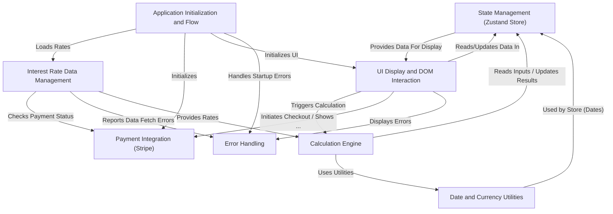

# Tutorial: coi-calculator

The Court Order Interest Calculator is a web application designed to
calculate interest on court judgments and special damages. It fetches
either **accurate historical interest rates** from a database (Firebase) if
the user has paid for access, or uses **approximate mock rates** in demo mode.
Users input judgment details, dates, and special damages through a web interface,
which are managed by a **central state store**. A **calculation engine**
then processes these inputs using the appropriate rates, and the
**user interface** displays the results, including detailed breakdowns and
a per diem amount. The application handles **payment processing** via Stripe
and includes **error handling** for issues like failed data fetching.

## Visual Overview

## Chapters

1. [Application Initialization and Flow
](01_application_initialization_and_flow_.md)
2. [UI Display and DOM Interaction
](02_ui_display_and_dom_interaction_.md)
3. [Date and Currency Utilities
](03_date_and_currency_utilities_.md)
4. [State Management (Zustand Store)
](04_state_management__zustand_store__.md)
5. [Payment Integration (Stripe)
](05_payment_integration__stripe__.md)
6. [Interest Rate Data Management
](06_interest_rate_data_management_.md)
7. [Calculation Engine
](07_calculation_engine_.md)
8. [Error Handling
](08_error_handling_.md)