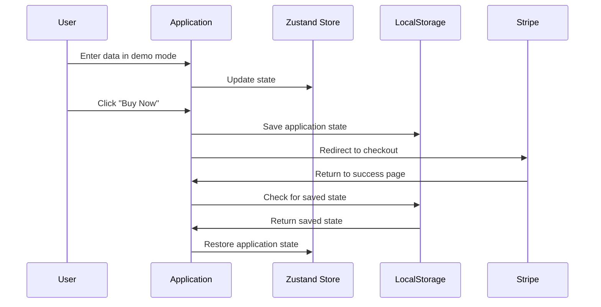

# Data Persistence Between Demo and Paid Versions

This document describes how user data entered in the demo version persists when users make a payment and transition to the paid version.

## Implementation Overview

The solution uses localStorage to temporarily store the user's input data and calculation results before redirecting to the Stripe payment flow. When the user returns to the application after a successful payment, this data is restored, providing a seamless experience.

## Key Components

### 1. State Storage and Retrieval

The application uses Zustand's store to provide two key functions:

- `saveStateToLocalStorage()`: Saves the current application state to localStorage before redirecting to Stripe.
- `restoreStateFromLocalStorage()`: Restores the application state when returning from a successful payment.

### 2. Payment Flow Integration

The payment flow has been modified to:

1. Save state before redirecting to the Stripe checkout page
2. Set flags to indicate returning from payment
3. Restore state automatically after a successful payment

### 3. Timeout and Expiration

Saved state includes a timestamp and will expire after 30 minutes to prevent stale data issues.

## Testing the Feature

### Automated Testing

The `test-state-persistence.js` script provides test functions accessible from the browser console:

- `testStatePersistence()`: Manually saves state and simulates a payment verification
- `testStateRestore()`: Manually triggers state restoration from localStorage

### Manual Testing

To test the complete flow:

1. Enter data in the demo version
2. Click "Buy Now" 
3. Complete the Stripe checkout flow
4. Verify data persists when redirected back to the application

### Edge Cases Handled

- **No saved state**: Falls back to default values when no state is found
- **Expired state**: Cleans up state older than 30 minutes
- **Storage errors**: Gracefully handles localStorage errors

## Implementation Files

The following files were modified to implement this feature:

- `store.js`: Added state persistence functions to the Zustand store
- `demo-mode.js`: Updated payment flow to save state before redirecting
- `app-initializer.js`: Added state restoration on application initialization
- `success.html`: Modified to pass state persistence flags during redirection
- `test-state-persistence.js`: Added for testing the implementation

## Usage Notes

- State is automatically saved when clicking any "Buy Now" buttons
- State is automatically restored when returning from a successful payment
- The localStorage key `coi_calculator_state` is used for temporary storage
- State is removed from localStorage after successful restoration
