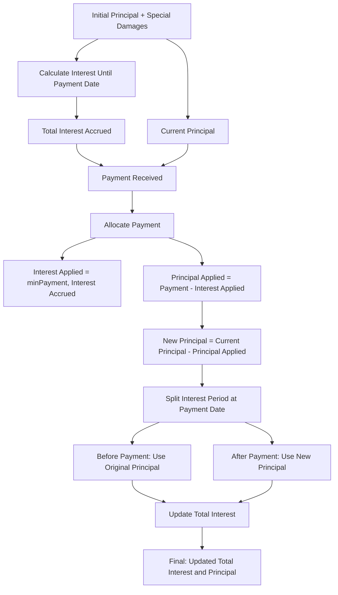

```mermaid
flowchart TD
    A[Initial Principal + Special Damages] --> B[Calculate Interest Until Payment Date]
    B --> C[Total Interest Accrued]
    A --> D[Current Principal]
    C --> E[Payment Received]
    D --> E
    E --> F[Allocate Payment]
    F --> G[Interest Applied = minPayment, Interest Accrued]
    F --> H[Principal Applied = Payment - Interest Applied]
    H --> I[New Principal = Current Principal - Principal Applied]
    I --> J[Split Interest Period at Payment Date]
    J --> K[Before Payment: Use Original Principal]
    J --> L[After Payment: Use New Principal]
    K --> M[Update Total Interest]
    L --> M
    M --> N[Final: Updated Total Interest and Principal]
```