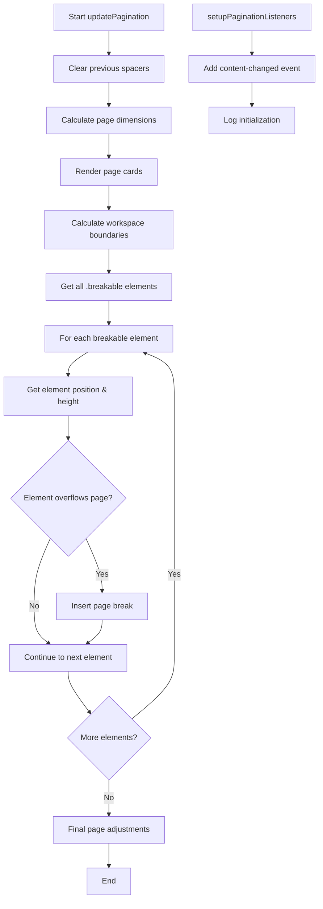

# `pageBreaksCore.js` Logic Flow

This diagram illustrates the logical flow of the `updatePagination` function in pageBreaksCore.js.

## Detailed Explanation

1. **Initialization**
   - Clear existing spacers and visual indicators
   - Get DOM elements (ink layer, paper layer, table bodies)
   - Calculate initial measurements for the paper layout

2. **Page Setup**
   - Render page cards based on content height
   - Calculate workspace boundaries for each page
   - Add visual indicators for debugging (page top/bottom markers)

3. **Processing Breakable Elements**
   - Get all elements with `.breakable` class
   - For each element:
     - Calculate block height (distance to next breakable element)
     - Determine which page the element is on
     - Check if the element's block overflows the current page
     - If overflow detected, insert a page break before the element

4. **Final Adjustments**
   - Check positioning of final elements (like table footers)
   - Add or remove pages as needed
   - Ensure proper spacing throughout document

5. **Event Handling**
   - Setup listeners to trigger pagination updates when content changes
