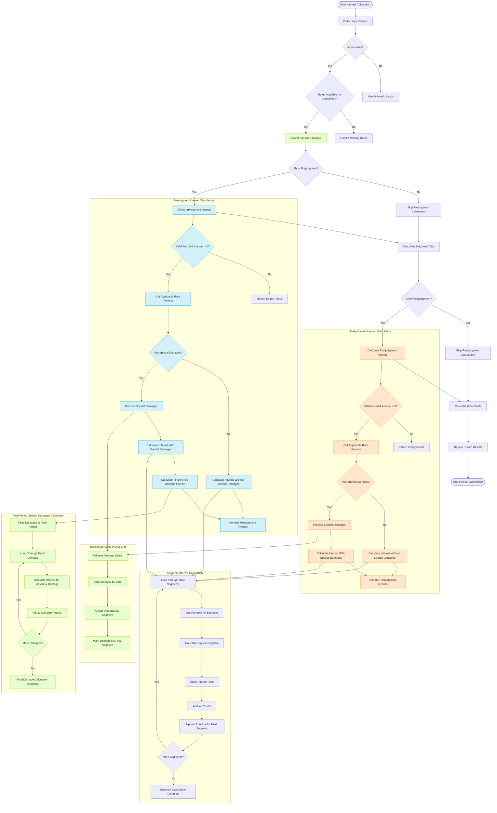

# Interest Calculation Logic Flow

The following mermaid diagram illustrates the prejudgment and postjudgment interest calculation logic flow in the COI Calculator:

## Key Differences Between Prejudgment and Postjudgment Interest

1. **Date Ranges**:
   - **Prejudgment**: From prejudgment start date to the day before judgment date
   - **Postjudgment**: From the latest judgment date to the postjudgment end date

2. **Principal Amounts**:
   - **Prejudgment**: Based on pecuniary damages only (judgmentAwarded)
   - **Postjudgment**: Based on total judgment (including prejudgment interest, non-pecuniary damages, costs, and special damages)

3. **Special Damages Handling**:
   - **Prejudgment**: Special damages in the final period have interest calculated individually
   - **Postjudgment**: All special damages are incorporated into the principal

4. **Interest Rates**:
   - Different rates apply for prejudgment vs. postjudgment periods (typically postjudgment rates are 2% higher)

## Special Damages Handling

Special damages are handled differently depending on when they occur:

1. **Regular Periods**: Special damages are added to the principal for the next segment
2. **Final Period Before Judgment**: For special damages in the final period before judgment, interest is calculated separately for each damage

This distinction is crucial for accurate interest calculations and reflects the business rule that special damages in the final period are treated differently from those in earlier periods.
