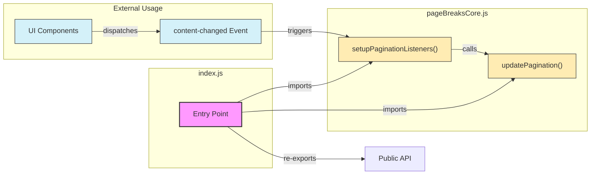

# Page Breaks Module Entry Point (index.js)

This diagram illustrates the structure of the `index.js` file, which serves as the entry point for the page breaks module, and shows how the event-based pagination architecture is exposed.

## Description

The `index.js` file serves as the main entry point for the page breaks module. It:

1. Imports the core pagination functions from `pageBreaksCore.js`:
   - `updatePagination()`: Handles the actual pagination logic
   - `setupPaginationListeners()`: Sets up event listeners for the 'content-changed' event

2. Re-exports these functions as the module's public API

3. Provides a clean interface for external code to use the pagination functionality

This design follows the facade pattern, where `index.js` presents a simplified interface to the more complex underlying pagination system.

## Event-Based Architecture

The module implements an event-based architecture where:

1. UI components dispatch a 'content-changed' event when content changes
2. The `setupPaginationListeners()` function listens for this event
3. When triggered, it calls `updatePagination()` to recalculate page breaks

This decoupled approach separates UI concerns from pagination logic, making the code more maintainable and easier to extend.
