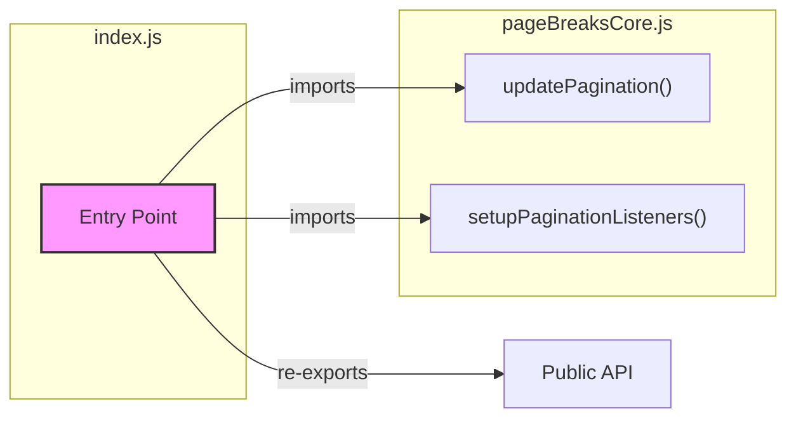

# Page Breaks Module Entry Point (index.js)

This diagram illustrates the structure of the `index.js` file, which serves as the entry point for the page breaks module.

## Description

The `index.js` file serves as the main entry point for the page breaks module. It:

1.  Imports the core pagination functions from `pageBreaksCore.js`
2.  Re-exports these functions as the module's public API
3.  Provides a clean interface for external code to use the pagination functionality

This design follows the facade pattern, where `index.js` presents a simplified interface to the more complex underlying pagination system.