# Page Breaks Core Framework (pageBreaksCore.js)

This diagram illustrates the flow of the `updatePagination()` function in the `pageBreaksCore.js` file, which is the main pagination framework.

```mermaid
flowchart TD
    A["Start: updatePagination()"] --> B["Clear Previous Breaks"]
    B --> C["Get DOM Elements"]
    C --> D{"DOM Elements Found?"}
    D -->|No| E["Error: Abort Pagination"]
    D -->|Yes| F["Measure Ink Layer"]
    
    F --> G["Render First Page Card"]
    G --> H["Calculate Workspace Height"]
    H --> I["Calculate Initial Page Count"]
    I --> J["Render All Page Cards"]
    J --> K["Calculate Workspace Boundaries"]
    K --> L["Add Visual Indicators"]
    L --> M["Get Table Footer Height"]
    
    M --> N["Initialize Page Index"]
    
    %% Process Prejudgment Rows
    N --> O["Process Prejudgment Rows"]
    O --> P{"For Each Row"}
    P --> Q["Create Context Object"]
    Q --> R["Call processTableRow()"]
    R --> S{"Page Break Inserted?"}
    S -->|Yes| T["Update Ink Layer Height"]
    T --> U["Update Page Index"]
    U --> V{"More Rows?"}
    S -->|No| V
    V -->|Yes| P
    V -->|No| W["Find Postjudgment Title"]
    
    %% Process Postjudgment Title
    W --> X{"Title Found?"}
    X -->|Yes| Y["Create Context Object"]
    Y --> Z["Call processSectionTitle()"]
    Z --> AA{"Page Break Inserted?"}
    AA -->|Yes| AB["Update Ink Layer Height"]
    AB --> AC["Update Page Index"]
    AC --> AD["Process Postjudgment Rows"]
    X -->|No| AD
    AA -->|No| AD
    
    %% Process Postjudgment Rows
    AD --> AE{"For Each Row"}
    AE --> AF["Create Context Object"]
    AF --> AG["Call processTableRow()"]
    AG --> AH{"Page Break Inserted?"}
    AH -->|Yes| AI["Update Ink Layer Height"]
    AI --> AJ["Update Page Index"]
    AJ --> AK{"More Rows?"}
    AH -->|No| AK
    AK -->|Yes| AE
    AK -->|No| AL["Final Page Adjustments"]
    
    %% Final Adjustments
    AL --> AM{"Footer Found?"}
    AM -->|Yes| AN{"Content Overflows Last Page?"}
    AN -->|Yes| AO["Add Additional Page"]
    AN -->|No| AP{"Last Page Unnecessary?"}
    AP -->|Yes| AQ["Remove Last Page"]
    AP -->|No| AR["End: Pagination Complete"]
    AO --> AR
    AQ --> AR
    AM -->|No| AR
    
    classDef current fill:#f9f,stroke:#333,stroke-width:2px;
    class A current;
```

## Description

The `pageBreaksCore.js` file contains the main pagination framework, with the `updatePagination()` function as its core. The function:

1. **Initialization**:
   - Clears previous page breaks
   - Gets references to DOM elements
   - Performs initial measurements

2. **Page Setup**:
   - Renders page cards
   - Calculates workspace boundaries
   - Adds visual indicators for debugging

3. **Element Processing**:
   - Processes prejudgment table rows
   - Processes the postjudgment title
   - Processes postjudgment table rows
   - Uses specialized processors for each element type

4. **Final Adjustments**:
   - Checks if content overflows the last page
   - Adds or removes pages as needed

The function delegates the actual page break insertion logic to specialized processors, maintaining a clean separation of concerns.
