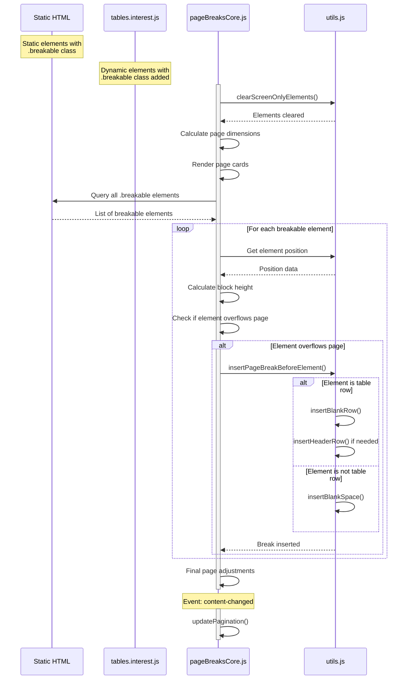

# Pagination Sequence Flow

This diagram illustrates the sequential flow of operations during pagination processing.

## Key Sequence Points

1. **Initialization**
   - The process begins by clearing any previous pagination elements
   - Page dimensions are calculated and page cards are rendered
   - All elements with the `.breakable` class are collected

2. **Element Processing**
   - Each breakable element is examined in sequence
   - For each element, its position and the height of its "block" are calculated
   - If an element would overflow its current page, a page break is inserted before it

3. **Type-Specific Handling**
   - Table rows receive special treatment with blank rows and repeated headers
   - Non-table elements receive generic spacing divs

4. **Event-Based Updates**
   - When content changes (e.g., new data added, visibility changed), the pagination is recalculated
   - A 'content-changed' event triggers the entire process to run again

This unified approach simplifies pagination by focusing on the `.breakable` class rather than element-specific processing logic, making the system more maintainable and consistent.
