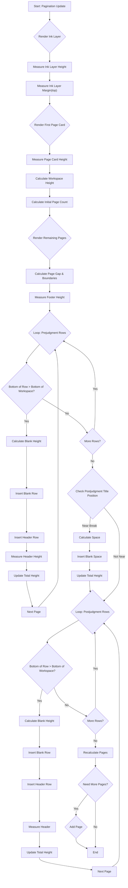

# Pagination Flow Diagram

```mermaid
flowchart TD
    A["Start: Pagination Update"] --> B{"Render Ink Layer"}
    B --> C["Measure Ink Layer Height"]
    C --> D["Measure Ink Layer Margin(top)"]
    D --> E{"Render First Page Card"}
    E --> F["Measure Page Card Height"]
    F --> G["Calculate Workspace Height"]
    G --> H["Calculate Initial Page Count"]
    H --> I{"Render Remaining Pages"}
    I --> J["Calculate Page Gap & Boundaries"]
    J --> K["Measure Footer Height"]
    K --> L{"Loop: Prejudgment Rows"}
    L --> M{"Bottom of Row > Bottom of Workspace?"}
    M -->|Yes| N["Calculate Blank Height"]
    N --> O["Insert Blank Row"]
    O --> P["Insert Header Row"]
    P --> Q["Measure Header Height"]
    Q --> R["Update Total Height"]
    R --> S["Next Page"]
    S --> L
    M -->|No| T{"More Rows?"}
    T -->|Yes| L
    T -->|No| U{"Check Postjudgment Title Position"}
    U -->|Near Break| V["Calculate Space"]
    V --> W["Insert Blank Space"]
    W --> X["Update Total Height"]
    X --> Y{"Loop: Postjudgment Rows"}
    U -->|Not Near| Y
    Y --> Z{"Bottom of Row > Bottom of Workspace?"}
    Z -->|Yes| AA["Calculate Blank Height"]
    AA --> AB["Insert Blank Row"]
    AB --> AC["Insert Header Row"]
    AC --> AD["Measure Header"]
    AD --> AE["Update Total Height"]
    AE --> AF["Next Page"]
    AF --> Y
    Z -->|No| AG{"More Rows?"}
    AG -->|Yes| Y
    AG -->|No| AH["Recalculate Pages"]
    AH --> AI{"Need More Pages?"}
    AI -->|Yes| AJ{"Add Page"}
    AJ --> AK["End"]
    AI -->|No| AK
```
