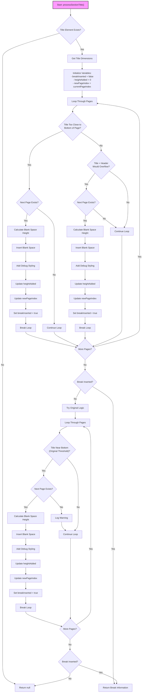

# Section Title Processor (sectionTitleProcessor.js)

This diagram illustrates the decision flow in the `processSectionTitle()` function from the `sectionTitleProcessor.js` file.

## Description

The `sectionTitleProcessor.js` file contains the `processSectionTitle()` function, which determines if a section title needs to be pushed to the next page. The function:

1. **Initial Checks**:
   - Validates the title element exists
   - Gets the title's dimensions

2. **Primary Logic**:
   - Checks if the title is too close to the bottom of any page
   - Checks if the title plus header would overflow the page

3. **Fallback Logic**:
   - If no break was inserted by the primary logic, tries the original logic
   - Uses a different threshold for determining if the title is near the bottom

4. **Result**:
   - Returns break information if a break was inserted
   - Returns null if no break was needed

The function uses multiple strategies to determine if a title needs pagination, ensuring that titles are properly positioned on pages.
