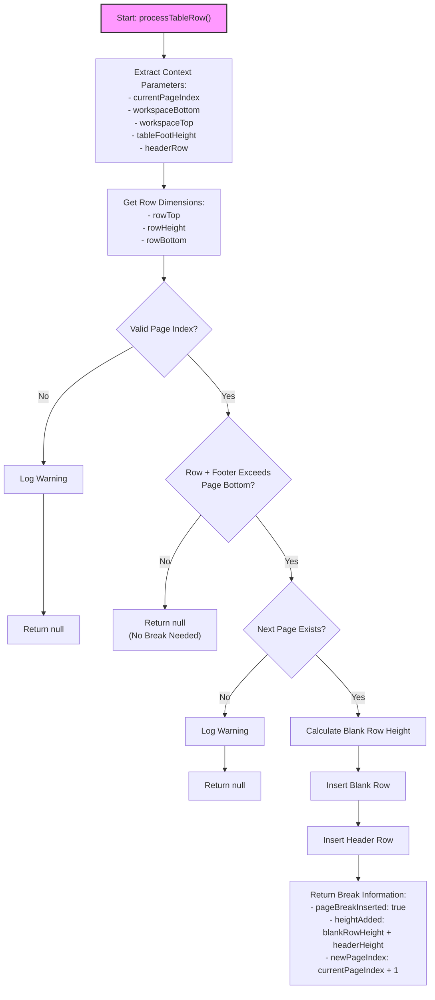

# Table Row Processor (tableRowProcessor.js)

This diagram illustrates the decision flow in the `processTableRow()` function from the `tableRowProcessor.js` file.

## Description

The `tableRowProcessor.js` file contains the `processTableRow()` function, which determines if a table row needs to be pushed to the next page. The function:

1. **Context Extraction**:
   - Extracts necessary parameters from the context object
   - Gets the row's dimensions

2. **Validation**:
   - Ensures the current page index is valid
   - Checks if the next page exists when needed

3. **Break Decision**:
   - Determines if the row (plus footer) would exceed the current page's bottom
   - Calculates the necessary blank space to push the row to the next page

4. **Break Insertion**:
   - Inserts a blank row with the calculated height
   - Inserts a cloned header row before the current row
   - Returns information about the inserted break

The function follows a clear decision tree to determine if pagination is needed, and handles edge cases like invalid page indices or missing next pages.
