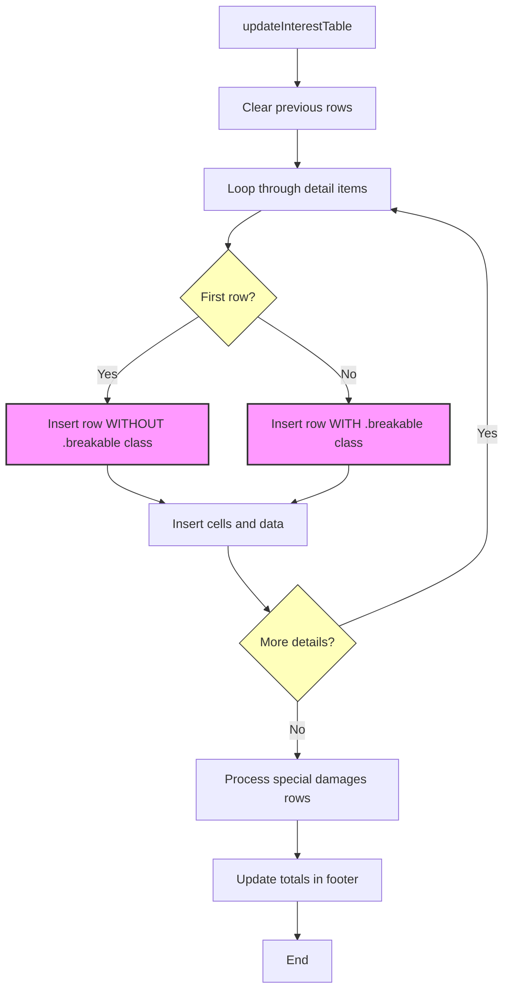

# `tables.interest.js` Integration

This diagram illustrates how table rows are prepared for pagination in the interest tables.



## Key Integration Points

The `updateInterestTable` function in tables.interest.js is responsible for creating table rows with the `.breakable` class properly applied:

1. **Selective Class Application:**
   - The first row in each table body does NOT receive the `.breakable` class
   - All subsequent rows DO receive the `.breakable` class
   - This prevents page breaks immediately after table headers

2. **Code Implementation:**
   ```javascript
   details.forEach((item, index) => {
       const row = tableBody.insertRow();

       // Add .breakable class to all rows except the first one
       if (index > 0) {
           row.classList.add('breakable');
       }
       
       // ... rest of row creation code
   });
   ```

3. **Benefits of this Approach:**
   - Preserves table header context by keeping at least one data row with each header
   - Maintains table readability across page breaks
   - Provides consistent pagination behavior for all dynamically generated table rows

This integration works seamlessly with the new pagination system because it focuses on adding the `.breakable` class to appropriate elements rather than requiring special processing logic for specific element types.
