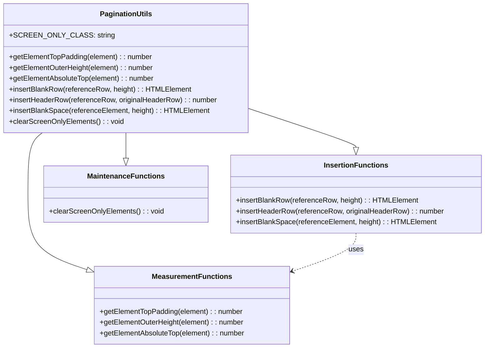
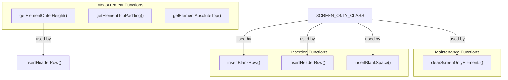

# Pagination Utilities (utils.js)

This diagram illustrates the utility functions in the `utils.js` file and their relationships.

## Function Relationships

## Description

The `utils.js` file provides utility functions for the pagination system, organized into three main categories:

1. **Measurement Functions**:
   - `getElementTopPadding()`: Gets the computed top padding of an element
   - `getElementOuterHeight()`: Gets the height of an element, including padding and border
   - `getElementAbsoluteTop()`: Gets the absolute vertical position of an element

2. **Insertion Functions**:
   - `insertBlankRow()`: Creates and inserts a blank table row for spacing
   - `insertHeaderRow()`: Creates and inserts a cloned table header row
   - `insertBlankSpace()`: Creates and inserts blank space (div) before an element

3. **Maintenance Functions**:
   - `clearScreenOnlyElements()`: Removes all elements with the screen-only class

These utility functions provide the foundation for the pagination system, handling DOM measurements and manipulations that are used by the higher-level processors.
