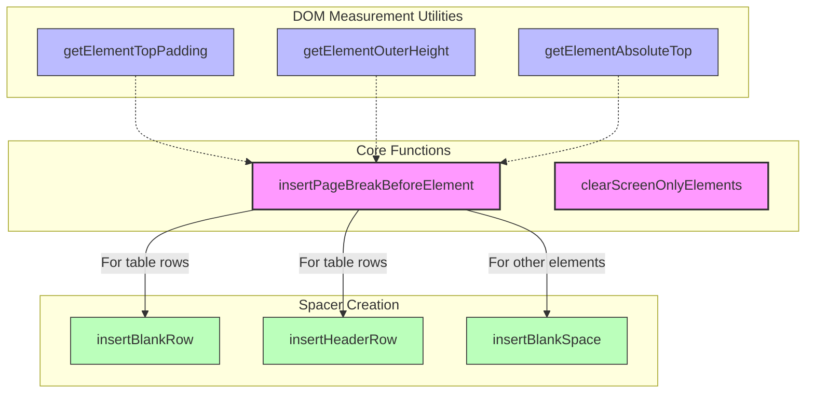

# `utils.js` Function Relationships

This diagram illustrates the relationships between utility functions in utils.js that support the pagination system.

## Function Descriptions

### DOM Measurement Utilities

- **getElementTopPadding**: Gets the computed top padding of an element in pixels.
- **getElementOuterHeight**: Gets the height of an element, including padding and border.
- **getElementAbsoluteTop**: Gets the absolute vertical position of an element relative to the document.

### Spacer Creation

- **insertBlankRow**: Creates and inserts a blank table row for spacing.
- **insertHeaderRow**: Creates and inserts a cloned table header row for repeated headers.
- **insertBlankSpace**: Creates and inserts blank space (div) before an element.

### Core Functions

- **insertPageBreakBeforeElement**: Inserts appropriate spacers and potentially repeated headers before elements. This is the key function that determines what kind of break to insert based on element type.
- **clearScreenOnlyElements**: Removes all elements with the screen-only class to clean up before recalculating.

## Key Improvements in New Implementation

The new `insertPageBreakBeforeElement` function centralizes the logic for creating page breaks, handling both:

1. **Table rows**: Inserts blank rows with appropriate colspan and optionally repeats table headers
2. **Other elements**: Inserts appropriate spacing divs

This design eliminates the need for separate processor modules by using element type detection instead.
