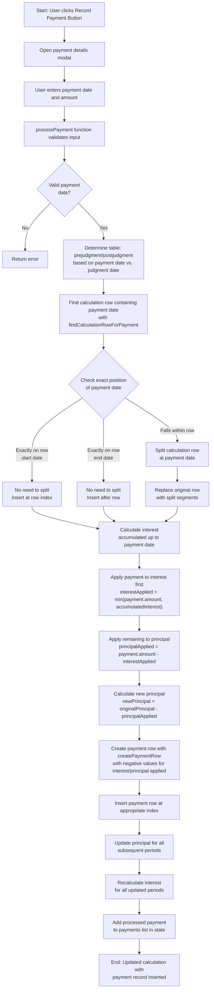

# Current Payment Record Insertion

This document describes the current implementation of how payment records are inserted into the prejudgment interest table in the COI Calculator.

## Current Implementation Details

The payment record insertion process is distributed across multiple files:

### 1. DOM Handling (`dom/payments.js`)
- `insertPaymentRow`: Creates editable payment UI rows when user clicks "Record Payment"
- `insertPaymentRowFromData`: Restores saved payment rows when rebuilding tables 

### 2. Core Payment Processing (`payment-processor.js`)
- `processPayment`: Handles payment validation and initial calculations
- `calculateInterestToDate`: Calculates accumulated interest up to payment date
- `recalculateWithPayments`: Performs full recalculation with all payments

### 3. Main Insertion Algorithm (`payment-insertion.js`)
- `insertPaymentRecord`: Orchestrates the entire insertion process
- `findCalculationRowForPayment`: Locates where the payment should be inserted
- `splitCalculationRowAtPaymentDate`: Splits interest periods when needed
- `createPaymentRow`: Creates the data object for a payment row
- `updateSubsequentPeriods`: Updates principal amounts after payment
- `recalculateTotals`: Recalculates interest totals after insertion

### 4. Table Rendering (`dom/tables.interest.js`)
- `updateInterestTable`: Rebuilds the table with all rows including payments

## Special Handling in Current Implementation

The current algorithm includes several edge cases and special handling:

1. **Position Detection**:
   - Exact match with row start date
   - Exact match with row end date
   - Falls within a row's date range
   - Falls between rows

2. **Row Splitting Logic**:
   - Calculates proportional interest for split periods
   - Maintains correct rate for each segment
   - Handles date boundaries precisely

3. **Payment Application**:
   - Always applies to interest first, then principal
   - Uses negative values in the UI to show reductions

4. **Principal Updating**:
   - Updates principal for all subsequent calculation periods
   - Recalculates interest based on new principal values
   - Prevents principal from going below zero (in some cases)

## Key Differences from Proposed Implementation

The current implementation has more complexity around:
- Finding the appropriate row position
- Handling edge cases for date boundaries
- Specific UI representation of payment amounts
- Special case handling for rate change dates
