# Current Payment Insertion Algorithm

The following diagram illustrates the current algorithm used by the application to insert payment records into spreadsheets:

## Proposed Algorithm (from insert_pay_example)

For comparison, here is the algorithm proposed in insert_pay_example:

```mermaid
flowchart TD
    A[Start: New Payment Record] --> B{Payment date ≤\nJudgment date?}
    B -->|Yes| C[Insert in prejudgment\ninterest table]
    B -->|No| D[Insert in postjudgment\ninterest table]
    
    C --> E{Payment date falls\nbetween existing\ninterest rows?}
    D --> E
    
    E -->|Yes| G[Split calculation row\nat payment date]
    E -->|No| F[Find calculation row\ncontaining payment date]
    
    F --> G
    
    G --> H[Insert payment record row\nbetween split calculation rows]
    
    H --> I[Apply payment to interest first]
    
    I --> J[Apply remaining amount to principal]
    
    J --> K[Update principal amount\nfor subsequent periods]
    
    K --> L[End: Payment Record Added]
```

## Key Differences

1. The proposed algorithm is more straightforward and follows a clearer linear flow
2. The current implementation has additional complexity for handling edge cases
3. The current implementation prevents principal from going below zero, while the proposed approach allows negative principal to indicate refund needs
4. The current implementation has special case handling for rate change dates
