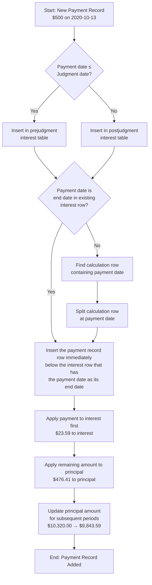

```mermaid
flowchart TD
    A[Start: New Payment Record<br>$500 on 2020-10-13] --> B{Payment date ≤<br>Judgment date?}
    B -->|Yes| C[Insert in prejudgment<br>interest table]
    B -->|No| D[Insert in postjudgment<br>interest table]
    
    C --> E{Payment date is <br>end date in existing<br>interest row?}
    D --> E
    
    E -->|Yes| H[Insert the payment record row immediately<br>below the interest row that has<br>the payment date as its end date]
    E -->|No| F[Find calculation row<br>containing payment date]
    
    F --> G[Split calculation row<br>at payment date]
    
    G --> H
    
    H --> I[Apply payment to interest first<br>$23.59 to interest]
    
    I --> J[Apply remaining amount to principal<br>$476.41 to principal]
    
    J --> K[Update principal amount<br>for subsequent periods<br>$10,320.00 → $9,843.59]
    
    K --> L[End: Payment Record Added]
```
