# Payment Insertion Algorithm Implementation

This document details the implementation of the payment insertion algorithm following the approach outlined in `insert_pay_example.md`.

## Algorithm Overview

```mermaid
flowchart TD
    A[Start: New Payment Record] --> B{Payment date ≤\nJudgment date?}
    B -->|Yes| C[Insert in prejudgment\ninterest table]
    B -->|No| D[Insert in postjudgment\ninterest table]
    
    C --> E{Payment date falls\nbetween existing\ninterest rows?}
    D --> E
    
    E -->|Yes| G[Split calculation row\nat payment date]
    E -->|No| F[Find calculation row\ncontaining payment date]
    
    F --> G
    
    G --> H[Insert payment record row\nbetween split calculation rows]
    
    H --> I[Apply payment to interest first]
    
    I --> J[Apply remaining amount to principal]
    
    J --> K[Update principal amount\nfor subsequent periods]
    
    K --> L[End: Payment Record Added]
```



## Implementation Files

The implementation consists of the following files:

1. `BC COIA calculator/payment-insertion.js` - The core algorithm
2. `BC COIA calculator/record-payment.js` - UI integration
3. `Testing/payment-insertion.test.js` - Unit tests

## Core Functions

### `insertPaymentRecord(state, payment, ratesData)`

This function inserts a payment record into the appropriate interest table and performs all necessary calculations:

1. Validates the payment data
2. Determines which table (prejudgment/postjudgment) to use based on payment date
3. Finds the calculation row containing the payment date
4. Splits the row at the payment date
5. Applies payment first to interest, then to principal
6. Updates all subsequent periods with the new principal
7. Returns an updated state object

### `processMultiplePayments(state, payments, ratesData)`

This function handles processing multiple payments in chronological order:

1. Sorts payments by date
2. Processes each payment one by one
3. Returns the final state

## Key Design Decisions

1. **Immutable State Updates**: The implementation creates deep copies of the state to avoid direct mutations, following functional programming principles.

2. **Negative Principal Allowed**: Unlike the previous implementation, this allows negative principal amounts to indicate refund situations.

3. **No Special Case for Rate Change Dates**: The algorithm treats all dates equally, simplifying the implementation.

4. **Clean Separation of Concerns**: The module focuses solely on payment insertion logic, with UI concerns handled separately.

5. **Comprehensive Validation**: Validates payment data before processing to prevent errors.

## Testing

The implementation includes comprehensive unit tests covering:

1. Basic payment insertion
2. Handling payments larger than outstanding interest
3. Allowing overpayments resulting in negative principal
4. Processing multiple payments in chronological order
5. Handling out-of-order payments

### Running the Tests

To run the tests:

```bash
cd Testing
npm test payment-insertion.test.js
```

## Usage in the Application

The payment insertion is triggered when:

1. User clicks the "Record Payment" button
2. The payment details modal appears
3. User enters payment date and amount
4. On confirmation, the `handleRecordPaymentClick` function in `record-payment.js`:
   - Gets the current application state from the store
   - Gets the rates data
   - Calls `insertPaymentRecord` with payment details
   - Updates the application state with the result

## Edge Cases Handled

1. **Payment Date Validation**: Ensures payment dates are valid Date objects
2. **Amount Validation**: Ensures payment amounts are positive numbers
3. **Date Format Consistency**: Normalizes date formats for consistent comparisons
4. **Chronological Processing**: Ensures multiple payments are processed in date order
5. **Overpayments**: Correctly handles payments exceeding total amount owing

## Implementation Differences from Previous Version

The new implementation improves upon the previous approach in several ways:

1. **Cleaner Algorithm Flow**: More straightforward and linear logic flow
2. **Less Special Case Handling**: Fewer special cases makes the code more maintainable
3. **More Consistent State Updates**: Better handling of state updates
4. **Simplified Principal Calculations**: More intuitive approach to calculating remaining principal
5. **Better Edge Case Handling**: More robust handling of edge cases

## Future Enhancements

Potential improvements to consider:

1. **Enhanced UI Feedback**: Clearer indication when payment creates a negative principal (refund situation)
2. **Audit Trail**: Add timestamps and user information to payment records
3. **Payment Editing**: Allow editing or deleting existing payments
4. **Payment Categories**: Support for different payment types or categories
